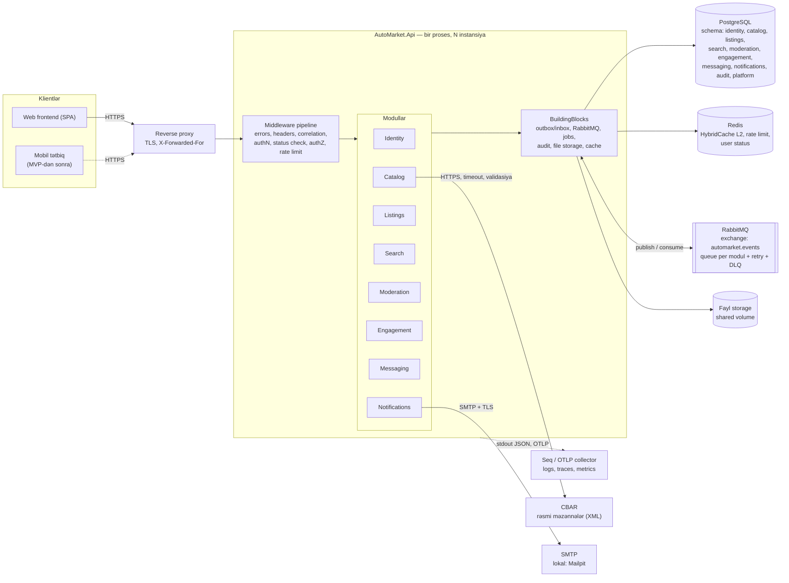
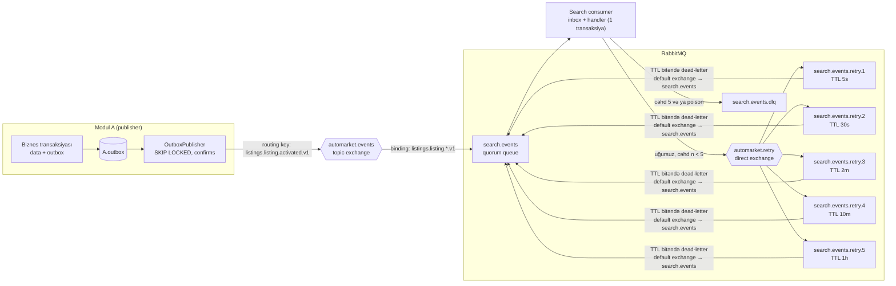
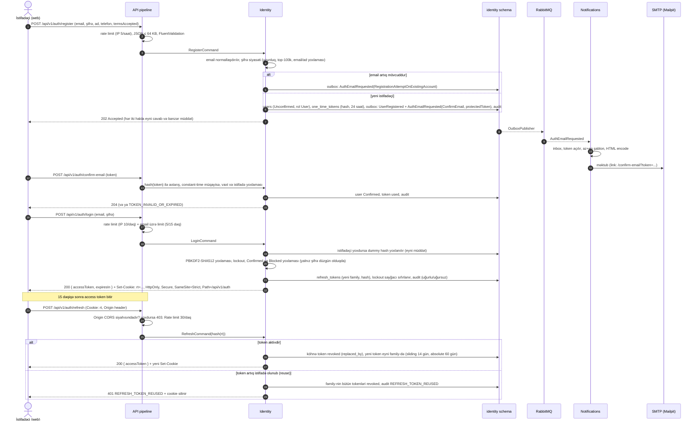
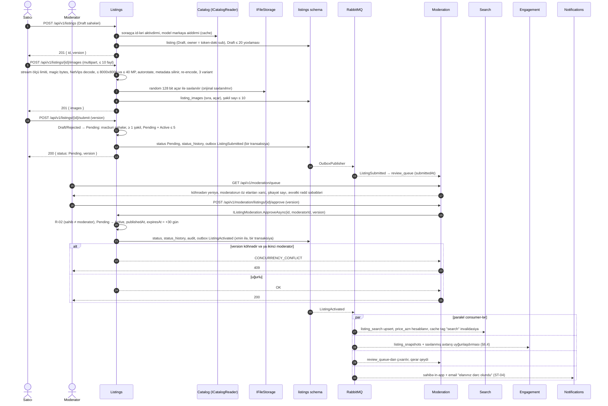
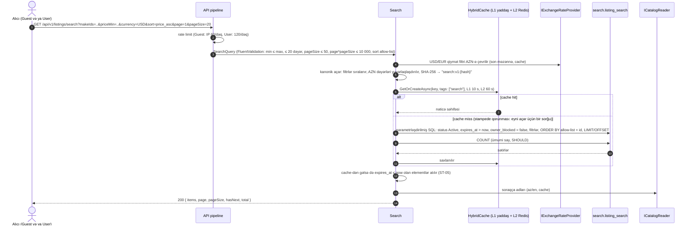
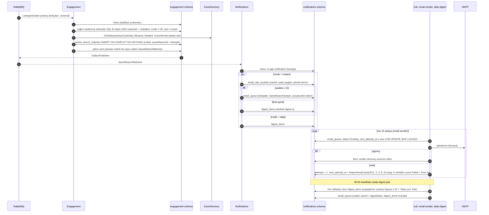
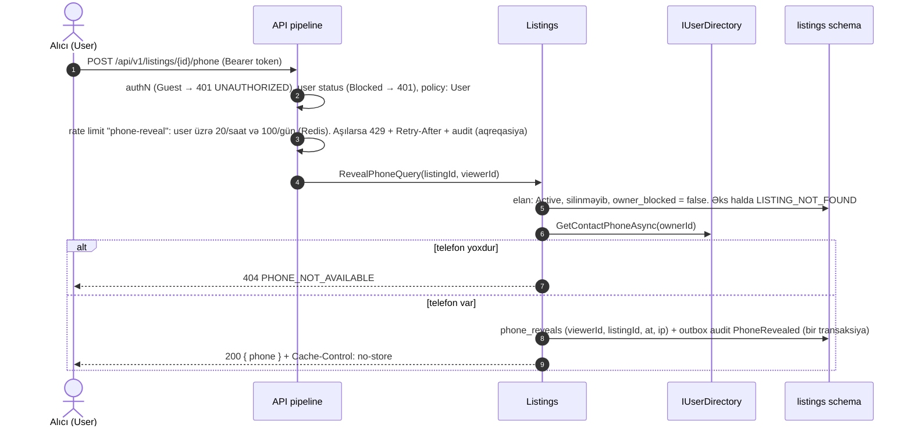
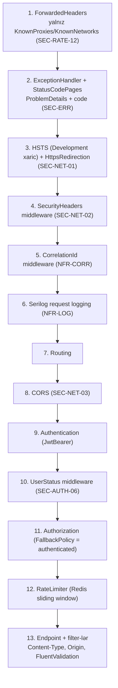

# AutoMarket — Arxitektura Sənədi

| Sahə | Dəyər |
|---|---|
| Versiya | 0.1 (qaralama) |
| Tarix | 2026-10-05 |
| Status | Review gözləyir |
| Əsas sənəd | [REQUIREMENTS.md](REQUIREMENTS.md) v0.3 |
| Qərarlar | [adr/](adr/README.md) |

> REQUIREMENTS **nə** edilməli olduğunu, bu sənəd isə bunun **necə** ediləcəyini təsvir edir. Sənəddə kod yoxdur. Sinif və interfeys adları istiqamət vermək üçündür və implementasiya zamanı dəqiqləşdirilə bilər.
> Hər əsas qərarın səbəbi və alternativləri ayrıca ADR-də yazılıb. Bu sənəd həmin qərarları bir yerdə birləşdirir.
> REQUIREMENTS-dəki tələb identifikatorlarına (`FR-*`, `SEC-*`, `NFR-*`, `Q*`) birbaşa istinad edilir.

### Texnologiya çərçivəsi (qısa)

| Sahə | Seçim | ADR |
|---|---|---|
| Platforma | C# / .NET 10, ASP.NET Core, Minimal API | [0010](adr/0010-api-style-minimal-api-no-mediatr.md) |
| Arxitektura | Modulyar monolit, bir deploy vahidi | [0001](adr/0001-modular-monolith.md), [0002](adr/0002-solution-structure-and-module-boundaries.md) |
| Verilənlər bazası | PostgreSQL 17, hər modul üçün ayrıca schema, EF Core (Npgsql) | [0002](adr/0002-solution-structure-and-module-boundaries.md) |
| Auth | ASP.NET Core Identity Core + öz JWT və refresh token həlli | [0003](adr/0003-authentication-identity-core-custom-tokens.md) |
| Modullar arası əlaqə | Contracts interfeysləri (sinxron) + integration event-lər (outbox → RabbitMQ) | [0004](adr/0004-inter-module-communication-and-outbox.md) |
| Messaging | `RabbitMQ.Client` + öz outbox/inbox | [0005](adr/0005-messaging-library-rabbitmq-client.md) |
| Background job-lar | Öz `BackgroundService` + Cronos + PostgreSQL advisory lock | [0006](adr/0006-background-jobs-hosted-services.md) |
| Cache | `HybridCache` (L1 yaddaş + L2 Redis) | [0007](adr/0007-caching-strategy-hybridcache-redis.md) |
| Fayl saxlama | `IFileStorage`, MVP-də lokal FS / shared volume | [0008](adr/0008-file-storage.md) |
| Şəkil emalı | NetVips (libvips) | [0009](adr/0009-image-processing-netvips.md) |
| Rate limiting | ASP.NET Core rate limiting middleware + Redis sliding window | [0011](adr/0011-distributed-rate-limiting-redis.md) |
| Axtarış | Search modulunun öz read model-i | [0012](adr/0012-search-read-model.md) |
| Logging / telemetriya | `ILogger` → Serilog (JSON, stdout), OpenTelemetry, lokal mühitdə Seq | [0013](adr/0013-logging-and-observability.md) |

---

## 1. Ümumi baxış

AutoMarket bir ASP.NET Core prosesi kimi deploy olunur (modulyar monolit). Proses bir neçə instansiyada işləyə bilər. Bütün instansiyalar stateless-dir: state PostgreSQL-də, Redis-də, RabbitMQ-da və fayl storage-da saxlanılır. Modullar eyni prosesdə yaşayır, amma hər birinin öz datası (PostgreSQL schema-sı) və açıq kontraktı var. Modullar bir-biri ilə ya kontrakt interfeysləri (in-process çağırış), ya da RabbitMQ üzərindən integration event-lər ilə əlaqə saxlayır.



Əsas prinsiplər:

1. **Bir deploy vahidi, aydın modul sərhədləri.** Microservice-lərin əməliyyat yükü olmadan modulların ayrılması mümkündür. Lazım olsa, gələcəkdə bir modul ayrıca servisə çıxarıla bilər ([ADR-0001](adr/0001-modular-monolith.md)).
2. **Modul öz datasının yeganə sahibidir.** Başqa modulun cədvəlinə SQL ilə müraciət edilmir, başqa modulun daxili class-ları istifadə olunmur.
3. **Yazma əməliyyatı bir modulun bir transaksiyasıdır.** Digər modullara təsir integration event-lər ilə, outbox vasitəsilə ötürülür (eventual consistency).
4. **İstifadəçi sorğusunun cavab müddətinə ağır işlər təsir etmir** (NFR-PERF-03). Email, bildiriş uyğunlaşdırması, read model yenilənməsi və məzənnə yenilənməsi asinxron işləyir.
5. **Default təhlükəsiz.** Endpoint-lər default olaraq autentifikasiya tələb edir, input DTO-ları yalnız icazəli sahələri ehtiva edir, xəta cavablarında daxili məlumat olmur.
6. **Mümkün olan yerdə .NET-in öz imkanları istifadə olunur.** Kommersiya lisenziyasına keçmiş kitabxanalar seçilmir (bax: [§12](#12-kitabxanalar-və-lisenziyalar)).

---

## 2. Solution strukturu

### 2.1 Qovluq ağacı

```text
AutoMarket/
├── AutoMarket.slnx
├── global.json                      # .NET 10 SDK versiyası sabitlənir
├── Directory.Build.props            # Nullable, TreatWarningsAsErrors, analyzer-lər, LangVersion
├── Directory.Packages.props         # Central Package Management: bütün versiyalar bir yerdə
├── .editorconfig
├── docker-compose.yml               # lokal asılılıqlar (bax: §11)
├── docs/
├── src/
│   ├── Host/
│   │   └── AutoMarket.Api/          # Program.cs, composition root, appsettings*.json
│   ├── BuildingBlocks/
│   │   ├── AutoMarket.BuildingBlocks/
│   │   │   ├── Domain/              # Entity, AggregateRoot, DomainError, Money, Currency
│   │   │   ├── Application/         # Result<T>, ErrorCode, ICurrentUser, handler interfeysləri, paging
│   │   │   ├── Persistence/         # ModuleDbContext bazası, xmin concurrency, UUIDv7, konvensiyalar
│   │   │   ├── Messaging/           # IIntegrationEvent, envelope, Outbox, Inbox, RabbitMQ publisher/consumer
│   │   │   ├── Jobs/                # IScheduledJob, ScheduledJobHost, advisory lock, job_runs
│   │   │   ├── Audit/               # IAuditLog, AuditDbContext (schema: audit), audit consumer
│   │   │   ├── Caching/             # HybridCache konfiqurasiyası, açar konvensiyaları
│   │   │   ├── Storage/             # IFileStorage, LocalFileStorage
│   │   │   └── Security/            # token generator, hash, constant-time müqayisə, masking
│   │   └── AutoMarket.BuildingBlocks.Web/
│   │       ├── Errors/              # IExceptionHandler, ProblemDetails + code
│   │       ├── Validation/          # FluentValidation endpoint filter
│   │       ├── RateLimiting/        # Redis sliding window RateLimiter, policy-lər
│   │       ├── Security/            # security header-lər, Origin yoxlaması, user status middleware
│   │       ├── Correlation/         # X-Correlation-Id middleware
│   │       └── Endpoints/           # IModuleEndpoints, paging cavab modeli, versioning helper-ləri
│   └── Modules/
│       ├── Identity/
│       │   ├── AutoMarket.Identity/
│       │   │   ├── Domain/
│       │   │   ├── Application/
│       │   │   ├── Infrastructure/
│       │   │   ├── Api/
│       │   │   └── IdentityModule.cs        # yeganə public giriş nöqtəsi: AddIdentityModule / MapIdentityEndpoints
│       │   └── AutoMarket.Identity.Contracts/
│       │       ├── IUserDirectory.cs        # sinxron interfeys
│       │       └── Events/                  # integration event-lər
│       ├── Catalog/        (AutoMarket.Catalog, AutoMarket.Catalog.Contracts)
│       ├── Listings/       (AutoMarket.Listings, AutoMarket.Listings.Contracts)
│       ├── Search/         (AutoMarket.Search, AutoMarket.Search.Contracts)
│       ├── Moderation/     (AutoMarket.Moderation, AutoMarket.Moderation.Contracts)
│       ├── Engagement/     (AutoMarket.Engagement, AutoMarket.Engagement.Contracts)
│       ├── Messaging/      (AutoMarket.Messaging, AutoMarket.Messaging.Contracts)
│       └── Notifications/  (AutoMarket.Notifications, AutoMarket.Notifications.Contracts)
└── tests/
    ├── AutoMarket.<Modul>.UnitTests/         # hər modul üçün: domen və application qaydaları
    ├── AutoMarket.BuildingBlocks.UnitTests/
    ├── AutoMarket.IntegrationTests/          # WebApplicationFactory + Testcontainers, bütün modullar
    ├── AutoMarket.ArchitectureTests/         # ArchUnitNET
    └── load/                                  # k6 ssenariləri (NFR-TEST-05)
```

`Search.Contracts`, `Moderation.Contracts` və başqa Contracts proyektləri boş və ya kiçik ola bilər. Hamısı yenə də yaradılır ki, struktur hər modulda eyni olsun.

### 2.2 Proyektlər və reference qaydaları

Hər modul **iki proyektdən** ibarətdir ([ADR-0002](adr/0002-solution-structure-and-module-boundaries.md)):

| Proyekt | Məzmun | Reference verə bilər |
|---|---|---|
| `AutoMarket.Api` (Host) | `Program.cs`, middleware pipeline, modulların qeydiyyatı, konfiqurasiya | bütün `AutoMarket.<M>`, `BuildingBlocks.Web` |
| `AutoMarket.<M>` | modulun bütün kodu: `Domain/`, `Application/`, `Infrastructure/`, `Api/` | `BuildingBlocks`, `BuildingBlocks.Web`, öz `<M>.Contracts`, **digər modulların yalnız `*.Contracts`** proyektləri |
| `AutoMarket.<M>.Contracts` | modulun açıq kontraktı: sinxron interfeyslər, onların DTO-ları, integration event-lər | yalnız `BuildingBlocks` (yalnız `IIntegrationEvent` və primitivlər üçün) |
| `AutoMarket.BuildingBlocks.Web` | HTTP ilə bağlı ümumi infrastruktur | `BuildingBlocks` |
| `AutoMarket.BuildingBlocks` | domen primitivləri, persistence, messaging, jobs, audit, storage | heç bir modul proyektinə reference vermir |

Qadağalar:

- `AutoMarket.<A>` → `AutoMarket.<B>` (başqa modulun əsas proyekti) reference-i **qadağandır**. Proyekt reference-i olmadığı üçün kompilyator başqa modulun class-larını görmür. Bu, birinci və ən güclü qoruma qatıdır.
- `*.Contracts` → `AutoMarket.<M>` reference-i qadağandır (kontrakt implementasiyadan asılı olmur).
- `BuildingBlocks*` → hər hansı modul reference-i qadağandır.
- Dövri reference yaranmır: `Listings` → `Catalog.Contracts` və `Catalog` → `Listings.Contracts` eyni anda mümkündür, çünki Contracts proyektləri ayrıdır.

### 2.3 Modul daxilində qatlar

Qatlar ayrıca proyekt deyil, modul proyektinin daxilində **qovluq və namespace** kimi ayrılır (`AutoMarket.Listings.Domain`, `AutoMarket.Listings.Application`, ...). Qaydalar arxitektura testləri ilə yoxlanılır (§10.4).

| Qat | Məzmun | Asılı ola bilər | Niyə ayrılıb |
|---|---|---|---|
| `Domain` | aggregate-lər (məs. `Listing`), value object-lər (`Money`, `Vin`, `Mileage`), status maşını, domen qaydaları və xətaları, domen hadisələri | yalnız `BuildingBlocks.Domain` | Biznes qaydaları (status keçidləri, limitlər, yuvarlaqlaşdırma) framework-dən asılı olmadan unit test olunur (NFR-TEST-01). EF Core, ASP.NET və ya RabbitMQ burada yoxdur |
| `Application` | use case handler-ləri (command/query), input/output modelləri, validator-lar, port interfeysləri (məs. `IListingRepository`, `IImageProcessor`), avtorizasiya qaydaları (sahiblik) | `Domain`, `BuildingBlocks.Application`, digər modulların `Contracts`-ı | Use case-lər nəqliyyatdan (HTTP, event, job) asılı deyil: eyni handler endpoint-dən, consumer-dən və ya job-dan çağırıla bilər |
| `Infrastructure` | `DbContext`, EF konfiqurasiyaları, migration-lar, repository-lər, xarici servis adapter-ləri (CBAR, SMTP, NetVips), event consumer-ləri, job-lar, Contracts interfeyslərinin implementasiyası | `Application`, `Domain`, `BuildingBlocks` | Texnologiyanı əvəz etmək və test zamanı fake ilə əvəzləmək (NFR-TEST-06) bu qatla məhdudlaşır |
| `Api` | Minimal API endpoint-ləri, route qrupları, request → command mapping-i, authorization və rate limit metadata-sı | `Application`, `BuildingBlocks.Web` | HTTP detalları (status kodu, header, cookie) use case-lərdən ayrılır |

Qeydlər:

- `Api` qatı `Infrastructure`-a, `Domain` qatı isə heç bir digər qata müraciət etmir. Composition (DI qeydiyyatı) modulun kökündəki `<M>Module.cs` faylında aparılır və yalnız bu fayl bütün qatları görür.
- Handler-lər sadə interfeyslərdir (`ICommandHandler<TCommand, TResult>`, `IQueryHandler<TQuery, TResult>`) və DI ilə birbaşa inject olunur. Mediator kitabxanası istifadə olunmur ([ADR-0010](adr/0010-api-style-minimal-api-no-mediatr.md)).
- Mapping əl ilə yazılır: hər endpoint-in öz input modeli (SEC-INP-03) və output modeli (SEC-AUTHZ-04) var. Entity heç vaxt birbaşa serializasiya olunmur.

---

## 3. Modul sərhədləri

### 3.1 Modulların məsuliyyəti, datası və kontraktı

| Modul | Məsuliyyət (REQUIREMENTS) | Schema və əsas cədvəllər | Sinxron kontrakt (`*.Contracts`) | Publish etdiyi event-lər |
|---|---|---|---|---|
| **Identity** | qeydiyyat, təsdiq, login, refresh, logout, şifrə bərpası/dəyişmə, profil və bildiriş ayarları, hesabın silinməsi və anonimləşdirilməsi, rollar, bloklama, istifadəçi siyahısı (FR-AUTH-*, FR-ACC-*, FR-ADM-*) | `identity`: `users`, `roles`, `user_roles`, `refresh_tokens`, `one_time_tokens`, `user_settings`, `outbox`, `inbox` | `IUserDirectory`: istifadəçinin public profili (ad, qeydiyyat tarixi), əlaqə telefonu, bildiriş üçün kontakt (email, ad, status, email ayarları), status (batch variantları ilə) | `UserRegistered`, `UserEmailConfirmed`, `UserBlocked`, `UserUnblocked`, `UserDeleted`, `UserAnonymized`, `UserRolesChanged`, `UserNotificationSettingsChanged`, `AuthEmailRequested` |
| **Catalog** | soraqçalar (marka, model, kuzov, yanacaq, sürətlər qutusu, şəhər), sabit enum-lar (rəng, ötürücü), CBAR məzənnələri (FR-DICT-*, FR-FX-01) | `catalog`: `dictionary_items`, `exchange_rates`, `outbox` | `ICatalogReader`: id-lərin aktivliyi və uyğunluğu (model ↔ marka), adlar (az/en); `IExchangeRateProvider`: son uğurlu məzənnə və onun tarixi | `DictionaryItemChanged`, `ExchangeRatesUpdated` |
| **Listings** | elanlar, status axını, şəkillər, "nömrəni göstər", AZN ekvivalentinin detal üçün hesablanması (FR-LST-*, FR-IMG-*, FR-FX-02) | `listings`: `listings`, `listing_images`, `listing_status_history`, `phone_reveals`, `outbox`, `inbox` | `IListingReader`: elanın qısa məlumatı (status, sahib, silinmə əlaməti, cover); `IListingModeration`: təsdiq, rədd, dərcdən çıxarma (bax: §5.1) | `ListingSubmitted`, `ListingWithdrawn`, `ListingActivated`, `ListingUpdated`, `ListingDeactivated`, `ListingVisibilityRestored`, `ListingExpiringSoon`, `ListingRejected`, `ListingDeleted` |
| **Search** | filtr, sıralama, pagination, axtarış cache-i (FR-SRCH-*) | `search`: `listing_search` (read model), `inbox` | — | — |
| **Moderation** | moderasiya növbəsi, rədd səbəbləri, elan şikayətləri (FR-MOD-*) | `moderation`: `review_queue`, `moderation_decisions`, `listing_reports`, `outbox`, `inbox` | `IReportSummary` (lazım olsa) | `ListingReported`, `ListingReportResolved` |
| **Engagement** | seçilmişlər, saxlanmış axtarışlar və onların yeni elanlarla uyğunlaşdırılması (FR-FAV-01, FR-SAVED-01, FR-NOTIF-01 AC1–AC4) | `engagement`: `favorites`, `saved_searches`, `saved_search_matches`, `listing_snapshots`, `outbox`, `inbox` | — | `SavedSearchMatched` |
| **Messaging** | thread-lər, mesajlar, bloklama, thread şikayəti, moderator tərəfindən audit ilə oxuma (FR-MSG-*) | `messaging`: `threads`, `messages`, `thread_reads`, `user_blocks`, `thread_reports`, `listing_snapshots`, `outbox`, `inbox` | — | `MessageSent`, `ThreadReported` |
| **Notifications** | in-app bildirişlər, email şablonları və göndərilməsi, instant/daily rejimləri, saatlıq limit, digest, abunəlikdən çıxma (FR-NOTIF-*, ST-04, NFR-ENV-05) | `notifications`: `notifications`, `email_queue`, `email_rate_buckets`, `digest_items`, `unsubscribe_tokens`, `inbox` | — | — |
| **BuildingBlocks.Audit** | dəyişdirilə bilməyən audit jurnalı (SEC-LOG-03/04/05), Admin üçün oxuma endpoint-i | `audit`: `audit_log`, `inbox` | `IAuditLog` (BuildingBlocks-da) | — |
| **Platform** (BuildingBlocks) | job icrası, Data Protection açarları | `platform`: `job_runs`, `data_protection_keys` | — | — |

### 3.2 Hansı modul hansı event-i consume edir

| Consumer | Consume etdiyi event-lər | Məqsəd |
|---|---|---|
| Listings | `UserBlocked`, `UserUnblocked`, `UserDeleted`, `ExchangeRatesUpdated` (cache invalidation) | sahib bloklananda elanları gizlətmək (FR-ADM-01 AC2), hesab silinəndə elanları soft delete etmək (FR-ACC-02 AC2) |
| Search | `ListingActivated`, `ListingUpdated`, `ListingDeactivated`, `ListingVisibilityRestored`, `ListingRejected`, `ListingDeleted`, `ExchangeRatesUpdated` | read model-i yeniləmək, AZN ekvivalentini yenidən hesablamaq (FR-FX-02 AC2) |
| Moderation | `ListingSubmitted`, `ListingWithdrawn`, `ListingActivated`, `ListingRejected`, `ListingDeleted` | növbəni və qərar tarixçəsini saxlamaq |
| Engagement | `ListingActivated`, `ListingUpdated`, `ListingDeactivated`, `ListingVisibilityRestored`, `ListingRejected`, `ListingDeleted`, `UserDeleted` | uyğunlaşdırma (FR-NOTIF-01), seçilmişlərdə "əlçatan deyil" statusu, saxlanmış axtarışların silinməsi |
| Messaging | `ListingActivated`, `ListingDeactivated`, `ListingDeleted`, `UserDeleted`, `UserAnonymized` | yeni thread açmaq/yazmaq qaydaları (FR-MSG-01 AC2, FR-MSG-02 AC5), "Silinmiş istifadəçi" |
| Notifications | `AuthEmailRequested`, `ListingActivated`, `ListingRejected`, `ListingDeactivated` (Expired), `ListingExpiringSoon`, `SavedSearchMatched`, `MessageSent`, `UserBlocked`, `UserDeleted` | email və in-app bildirişlər, bloklanmış/silinmiş istifadəçiyə göndərişin dayandırılması |
| Audit | `AuditRecorded` (bütün modulların outbox-undan) | audit jurnalına yazmaq |

Event-lərin tam siyahısı və payload-ları §5.4-dədir.

### 3.3 Sərhədlər necə məcbur edilir

| Mexanizm | Nəyi qoruyur | Necə |
|---|---|---|
| **Proyekt reference-ləri** | başqa modulun class-larına və DbContext-inə müraciət | `AutoMarket.<A>` yalnız `AutoMarket.<B>.Contracts`-a reference verə bilər. Başqa modulun əsas proyekti kompilyasiya zamanı görünmür. Host-dan başqa heç bir proyekt modulun əsas proyektinə reference vermir |
| **`internal` görünürlük** | modulun Contracts-dan kənar tiplərinin istifadəsi (məs. Host vasitəsilə) | `AutoMarket.<M>`-də yalnız `<M>Module` statik class-ı `public`-dir. Qalan bütün tiplər (entity, handler, DbContext, endpoint) `internal`-dır. `InternalsVisibleTo` yalnız `AutoMarket.<M>.UnitTests`, `AutoMarket.IntegrationTests` və EF design-time üçün verilir |
| **Arxitektura testləri** | qat qaydaları, namespace sərhədləri, adlandırma, `public` tiplərin məhdudlaşdırılması | ArchUnitNET (bax: §10.4). Testlər CI-da hər PR-da işləyir və uğursuz olarsa merge bloklanır (NFR-TEST-07) |
| **DB schema və rollar** | başqa modulun cədvəlinə SQL ilə müraciət | Hər modulun `DbContext`-i yalnız öz schema-sına map olunur (`HasDefaultSchema`). Raw SQL yalnız modulun öz Infrastructure qatında yazılır və öz schema-sına aiddir. SHOULD: production-da hər modul üçün ayrıca DB rolu yalnız öz schema-sında hüquqa malik olur (connection string-lər modul üzrə). MVP-də bir DB istifadəçisi + arxitektura testləri kifayətdir. Bu, açıq risk kimi qeyd olunub (§13) |
| **Code review qaydası** | Contracts-ın "geniş" olması | Contracts-a yalnız başqa modulun real ehtiyacı olan interfeys və DTO-lar əlavə olunur. Contracts-dakı DTO-lar entity deyil, sabit (immutable) `record` tipləridir |

---

## 4. Data

### 4.1 Verilənlər bazası və schema-lar

- **Bir PostgreSQL 17 bazası** (`automarket`) istifadə olunur. Hər modulun öz schema-sı var: `identity`, `catalog`, `listings`, `search`, `moderation`, `engagement`, `messaging`, `notifications`, `audit`, `platform`.
- Schema-lar arasında **foreign key yoxdur**. Başqa modulun id-si (məs. `listings.owner_id`) sadə `uuid` sütunudur. Referensial bütövlük event-lərlə təmin olunur: istifadəçi silinəndə `UserDeleted` event-i göndərilir və modullar öz datasını təmizləyir.
- Cross-schema `JOIN` qadağandır. Bir modula başqa modulun datası lazımdırsa, ya Contracts interfeysi çağırılır, ya da modul event-lərlə öz projection-ını saxlayır (məs. `engagement.listing_snapshots`, `search.listing_search`).

### 4.2 DbContext-lər

- Hər modulun öz `DbContext`-i var (`IdentityDbContext`, `ListingsDbContext`, ...). Hamısı `BuildingBlocks.Persistence`-dəki ortaq bazadan törəyir. Bu baza konvensiyaları tətbiq edir: `snake_case` adlandırma (EFCore.NamingConventions), UTC `timestamptz`, `decimal` → `numeric`, outbox/inbox cədvəllərinin map olunması.
- `HasDefaultSchema("<modul>")` istifadə olunur. Migration tarixçəsi hər modulun öz schema-sındadır: `MigrationsHistoryTable("__ef_migrations_history", "<modul>")`.
- Bütün DbContext-lər eyni connection string-i istifadə edə bilər. Fiziki bağlantı pool-u Npgsql data source vasitəsilə ortaqdır. Bir sorğu daxilində iki modulun DbContext-i eyni transaksiyada **işləmir**. Hər yazma bir modulun transaksiyasıdır, modullar arası təsir outbox ilə ötürülür.
- Identity modulunda ASP.NET Core Identity-nin EF store-u `IdentityDbContext` daxilində `identity` schema-sına map olunur. Cədvəl adları dəyişdirilir (`AspNetUsers` → `identity.users`).

### 4.3 Identifikatorlar, concurrency, tiplər

| Mövzu | Qərar | Tələb |
|---|---|---|
| Id-lər | `uuid`, kod tərəfində `Guid.CreateVersion7()` ilə yaradılır. UUIDv7 zamana görə sıralandığı üçün B-tree indeksi pozulmur, eyni zamanda public API-də təxmin edilə bilmir. Daxili tam ədəd id public API-də göstərilmir | SEC-AUTHZ-03 |
| Şəkil açarı | ayrıca 128 bit `RandomNumberGenerator` dəyəri (base64url). Elan id-si ilə əlaqəsi URL-də görünmür | SEC-FILE-06 |
| Optimistic concurrency | PostgreSQL-in sistem sütunu `xmin` concurrency token kimi istifadə olunur (Npgsql `UseXminAsConcurrencyToken`). API-də `version` sahəsi (və ya `ETag`/`If-Match`) olaraq qaytarılır. Köhnə versiya → `CONCURRENCY_CONFLICT` (409) | ST-02, FR-LST-03 AC6 |
| Pul | `numeric(14,2)` + `char(3)` valyuta. Kodda `Money` value object-i yalnız `decimal` istifadə edir. Məzənnə `numeric(12,6)` | NFR-MISC, FR-FX-02 AC3 |
| Vaxt | `timestamptz`, kodda `DateTimeOffset` (UTC). Vaxt `TimeProvider` vasitəsilə alınır (testdə `FakeTimeProvider`) | NFR-MISC, NFR-TEST-08 |
| Mətn müqayisəsi | Unikallıq və case-insensitive axtarış üçün ICU əsaslı non-deterministic collation (`und-u-ks-level2`) istifadə olunur. Email normallaşdırılmış (lower-case) halda saxlanılır və unikal indeksə malikdir. Soraqça adlarının unikallığı üçün normallaşdırılmış sütun (`lower(normalize(name, NFC))`) üzərində unikal indeks qurulur. Azərbaycan hərfləri (`İ/i`, `I/ı`) üçün test case-ləri məcburidir | NFR-MISC, FR-DICT-02 AC2 |
| Soft delete | `deleted_at timestamptz null` + EF global query filter. Silinmiş elan üçün public sorğuya `LISTING_NOT_FOUND` qaytarılır | FR-LST-04 |

### 4.4 Migration-lar

- Migration-lar hər modul üçün ayrıca yaradılır və həmin modulun `Infrastructure/Persistence/Migrations` qovluğunda saxlanılır. Hər modul üçün `IDesignTimeDbContextFactory` var. Əmr nümunəsi: `dotnet ef migrations add <Ad> --project src/Modules/Listings/AutoMarket.Listings --context ListingsDbContext`.
- **Production, Staging və Test (CI):** migration-lar `dotnet ef migrations bundle` ilə yaradılmış bundle-lar vasitəsilə deploy pipeline-ında, tətbiq yeni versiyası işə düşməzdən **əvvəl** ayrıca addım kimi tətbiq olunur. Tətbiq startup-da migration işlətmir, çünki bir neçə instansiya eyni anda migration-a başlaya bilər və tətbiqin DB istifadəçisinə DDL hüququ verilməməlidir.
- **Development:** startup-da avtomatik tətbiq olunur (`Database.MigrateAsync()`). Bu yalnız `IHostEnvironment.IsDevelopment()` olduqda işləyir və konfiqurasiya ilə söndürülə bilər. Integration testlər də migration-ları konteynerdəki bazaya test fixture-u vasitəsilə tətbiq edir.
- Migration-lar geriyə uyğun yazılır (expand → migrate → contract): sütun əvvəlcə əlavə olunur, kod yenilənir, köhnə sütun növbəti release-də silinir. Bu, rolling deploy zamanı köhnə və yeni instansiyaların birgə işləməsinə imkan verir.
- Quartz kimi xarici kitabxana schema-sı yoxdur. `platform` və `audit` schema-ları da BuildingBlocks-dakı öz DbContext-ləri ilə eyni qayda üzrə idarə olunur.

### 4.5 Əsas indekslər (istiqamət)

| Cədvəl | İndeks | Məqsəd |
|---|---|---|
| `listings.listings` | `(owner_id, status) where deleted_at is null` | limitlər (Draft ≤ 20, Pending + Active ≤ 5), "mənim elanlarım" |
| `listings.listings` | `(status, expires_at) where status = 'Active'` | Expire job-u |
| `search.listing_search` | `(published_at desc, id desc)`, `(price_azn, id)`, `(mileage, id)`, `(year desc, id desc)` | sıralama + deterministik keyset (FR-SRCH-02 AC2) |
| `search.listing_search` | `(make_id, model_id)`, `(city_id)`, `(body_type_id)` və digər filtr sütunları üzrə B-tree; lazım olsa çoxsütunlu partial indekslər | filtrlər |
| `engagement.saved_searches` | GIN (`make_ids`, `model_ids`, ... `int[]`/`uuid[]` massivləri) | yeni elanın uyğun saxlanmış axtarışlarını tapmaq |
| `identity.refresh_tokens` | `token_hash` unikal, `(user_id, revoked_at)`, `family_id` | refresh, reuse detection |
| `outbox` (hər schema) | `(processed_at) where processed_at is null`, `(occurred_at)` | publisher |
| `inbox` (hər schema) | `(message_id, consumer)` unikal | idempotentlik |

---

## 5. Modullar arası əlaqə

### 5.1 Sinxron (Contracts interfeysi) və asinxron (integration event)

| | Sinxron: Contracts interfeysi | Asinxron: integration event |
|---|---|---|
| Nə vaxt | Çağıranın cavaba **dərhal** ehtiyacı var: validasiya (soraqça id-si aktivdirmi), göstəriş üçün data (satıcının adı), sorğu nəticəsi xətanı müəyyən edir | Bir modulda baş verən fakt barədə digərlərini xəbərdar etmək: "elan aktiv oldu", "istifadəçi bloklandı" |
| Necə | DI ilə inject olunan interfeys (`ICatalogReader`), in-process metod çağırışı. İmplementasiya provayder modulun Infrastructure qatındadır və `internal`-dır | Outbox → RabbitMQ → consumer modulun inbox-u |
| Konsistentlik | Güclü (cari data) | Eventual (adətən < 1 saniyə, broker əlçatmazdırsa daha çox) |
| Qayda | Default olaraq **yalnız oxuma**. Yazma çağırışına yalnız istisna kimi icazə verilir (aşağıda) | Event keçmiş zamanda olan faktdır (`ListingActivated`), command deyil |
| Cache | Tez-tez çağırılan oxumalar provayder tərəfdə `HybridCache` ilə keşlənir (məs. soraqçalar, istifadəçinin public profili) | — |
| Xəta | İstisna çağırana ötürülür | Retry + DLQ (§5.3) |

**Sinxron yazma istisnası — moderasiya qərarı.** Moderator sorğusu `CONCURRENCY_CONFLICT` və `INVALID_STATUS_TRANSITION` cavabını dərhal almalıdır (ST-02). Elanın statusunun sahibi isə Listings modulu olduğu üçün Moderation modulu `IListingModeration.ApproveAsync(listingId, moderatorId, expectedVersion)` çağırır. Qaydalar:

1. Status keçidi, status tarixçəsi (ST-03), audit və outbox event-i **Listings-in bir transaksiyasında** yazılır.
2. Moderation həmin HTTP sorğusunda öz bazasına yazmır. Öz növbəsini və qərar qeydini `ListingActivated` / `ListingRejected` event-lərindən yeniləyir. Belə olduqda iki modulun transaksiyası arasında uyğunsuzluq yaranmır.
3. Bu istisna `Listings.Contracts`-da ayrıca interfeyslə (`IListingModeration`) məhdudlaşdırılır və [ADR-0004](adr/0004-inter-module-communication-and-outbox.md)-də sənədləşdirilib.

### 5.2 Outbox pattern

Problem: biznes datası PostgreSQL-ə yazılıb, event isə RabbitMQ-ya göndərilməyibsə (və ya əksinə), modullar arasında uyğunsuzluq yaranır. Həll — **transactional outbox**:

1. Handler aggregate-i dəyişir. Aggregate-in yaratdığı domen hadisələri `SaveChanges` zamanı integration event-lərə çevrilir və **eyni transaksiyada** həmin modulun `<schema>.outbox` cədvəlinə yazılır.
2. `OutboxPublisher` (`BackgroundService`, hər modulun schema-sı üçün) qısa intervalla (default 1 s, boş olanda 5 s-ə qədər backoff) bu sorğunu işlədir: `SELECT ... FROM outbox WHERE processed_at IS NULL ORDER BY occurred_at LIMIT 100 FOR UPDATE SKIP LOCKED`. `SKIP LOCKED` sayəsində bir neçə instansiya eyni sətri göndərmir.
3. Mesajlar RabbitMQ-ya **publisher confirms** ilə göndərilir (`persistent`, `mandatory`). Təsdiq gəldikdən sonra `processed_at` yazılır. Göndərmə uğursuz olarsa, `attempts` artırılır, `last_error` (qısaldılmış, secret-siz) yazılır və mesaj növbəti dövrdə yenidən cəhd olunur.
4. Bu axın **at-least-once** çatdırılma verir: confirm alındıqdan sonra, `processed_at` yazılmazdan əvvəl proses dayanarsa, mesaj təkrar göndərilir. Buna görə consumer-lər idempotentdir (§5.3).
5. Göndərilmiş outbox sətirləri 7 gün saxlanılır (diaqnostika üçün), sonra təmizləmə job-u ilə silinir.

Outbox cədvəli (hər modulda eyni struktur): `id (uuid, = messageId)`, `type`, `version`, `payload (jsonb)`, `occurred_at`, `correlation_id`, `traceparent`, `processed_at`, `attempts`, `last_error`.

Audit qeydləri də eyni mexanizmlə ötürülür: `IAuditLog.Record(...)` biznes transaksiyası daxilində həmin modulun outbox-una `AuditRecorded` mesajı əlavə edir. Belə olduqda audit qeydi biznes əməliyyatı ilə ya birlikdə yazılır, ya da heç yazılmır. Biznes transaksiyası olmayan hadisələr (uğursuz login, rate limit) Identity outbox-u vasitəsilə ayrıca qısa transaksiyada yazılır.

### 5.3 RabbitMQ topologiyası, retry, DLQ, idempotent consumer



| Element | Qərar |
|---|---|
| Exchange | Bir **topic exchange** `automarket.events` (durable). Routing key formatı: `<modul>.<aggregate>.<hadisə>.v<versiya>`, məs. `listings.listing.activated.v1` |
| Queue-lar | Hər consumer modul üçün bir **quorum queue**: `<modul>.events` (`search.events`, `notifications.events`, ...). Modul yalnız ehtiyac duyduğu routing key-lərə bind olunur. Bir modul daxilində mesaj tipinə görə handler-ə dispatch edilir |
| Topologiyanın yaradılması | Startup-da idempotent şəkildə elan olunur (`exchange/queue declare`, `bind`). Production-da tətbiq istifadəçisinin `configure` hüququ yalnız `automarket.*` adlarına məhdudlaşdırılır |
| Consumer | `RabbitMQ.Client` 7.x async consumer, manual ack, `prefetch = 16` (konfiqurasiyadan), modul başına konfiqurasiya edilən paralellik |
| Retry | Handler exception atarsa, mesaj orijinal header-ləri və `x-retry-count` ilə `automarket.retry` exchange-ə, `<queue>.retry.<n>` queue-suna göndərilir, sonra orijinal mesaj ack edilir. Retry queue-larının TTL-i bitəndə mesaj dead-letter mexanizmi ilə default exchange vasitəsilə yalnız həmin consumer-in queue-suna qayıdır (digər consumer-lər təkrar almır). Gecikmələr: 5 s, 30 s, 2 dəq, 10 dəq, 1 saat (konfiqurasiyadan) |
| DLQ | 5 uğursuz cəhddən sonra, deserializasiya olunmayan və ya bilinməyən versiyalı mesaj dərhal `<queue>.dlq`-ya göndərilir. DLQ-ya düşən hər mesaj `Error` səviyyəsində log-a yazılır. DLQ ölçüsü metrika kimi ixrac olunur və alert yaradır. DLQ-dan geri göndərmə (replay) MVP-də RabbitMQ management UI və ya kiçik admin skripti ilə əl ilə aparılır |
| İdempotent consumer | Hər modulun `<schema>.inbox` cədvəli var: `(message_id, consumer)` unikal açar, `processed_at`. Consumer **bir DB transaksiyasında** inbox-a sətir əlavə edir (`INSERT ... ON CONFLICT DO NOTHING`) və handler-i icra edir. Sətir artıq varsa (dublikat), handler çağırılmır və mesaj ack edilir. Inbox sətirləri 14 gün sonra təmizlənir |
| Biznes səviyyəsində idempotentlik | Əlavə olaraq hər handler mümkün olan yerdə təbii açarlarla idempotentdir: məs. `saved_search_matches (saved_search_id, listing_id)` unikal (FR-NOTIF-01 AC4), read model-də `listing_version` müqayisəsi |
| Sıra (ordering) | Qlobal sıra zəmanəti yoxdur (retry sıranı pozur). Projection-lar hər event-dəki `aggregateVersion` (elan üçün status/versiya sayğacı) ilə köhnə event-i atır: yalnız `incoming.version > stored.version` olduqda tətbiq olunur |
| Correlation | Envelope-da `correlationId` və W3C `traceparent` ötürülür. Consumer onları `Activity` və log scope-una bərpa edir (NFR-CORR) |

### 5.4 Integration event-lərin siyahısı

Envelope (bütün event-lər üçün): `messageId (uuid)`, `type` (routing key ilə eyni), `version`, `occurredAt (UTC)`, `correlationId`, `traceparent`, `payload`. Payload-da **şəxsi məlumat minimal saxlanılır**: email, telefon və mesaj mətni event-lərdə olmur. Yeganə istisna `AuthEmailRequested`-dir (aşağıda).

| Event (routing key) | Publisher | Payload (əsas sahələr) | Consumer-lər |
|---|---|---|---|
| `identity.user.registered.v1` | Identity | userId, registeredAt | (gələcək analitika üçün; MVP-də consumer yoxdur) |
| `identity.user.email-confirmed.v1` | Identity | userId | — |
| `identity.user.blocked.v1` | Identity | userId, blockedAt | Listings, Notifications |
| `identity.user.unblocked.v1` | Identity | userId | Listings |
| `identity.user.deleted.v1` | Identity | userId, deletedAt | Listings, Engagement, Messaging, Notifications |
| `identity.user.anonymized.v1` | Identity | userId | Messaging (cache invalidation) |
| `identity.user.roles-changed.v1` | Identity | userId, roles | — (user status cache-i Identity-nin öz daxilində invalidasiya olunur) |
| `identity.user.notification-settings-changed.v1` | Identity | userId, expiryEmail, messageEmail | Notifications (cache invalidation) |
| `identity.auth-email.requested.v1` | Identity | userId, kind (`ConfirmEmail`, `ResetPassword`, `PasswordChanged`, `LockedOut`, `RegistrationAttemptOnExistingAccount`, `AccountDeleted`), `protectedToken` (yalnız link olan məktublarda; Data Protection ilə şifrələnib) | Notifications |
| `catalog.dictionary-item.changed.v1` | Catalog | dictionaryType, itemId, isActive | Search və Listings (cache tag invalidation) |
| `catalog.exchange-rates.updated.v1` | Catalog | rateDate, usdAzn, eurAzn | Search (AZN ekvivalentini yenidən hesablamaq), Listings (cache) |
| `listings.listing.submitted.v1` | Listings | listingId, ownerId, submittedAt, version | Moderation |
| `listings.listing.withdrawn.v1` | Listings | listingId, version | Moderation |
| `listings.listing.activated.v1` | Listings | listingId, ownerId, version, publishedAt, expiresAt, axtarış atributları (make, model, year, body, fuel, gearbox, city, mileage, engineVolume, price, currency, coverImageKey), `isReactivation`, moderatorId | Search, Engagement, Moderation, Messaging, Notifications |
| `listings.listing.updated.v1` | Listings | listingId, version, dəyişmiş axtarış atributları (Active elanda moderasiyasız redaktə, FR-LST-03 AC4) | Search, Engagement |
| `listings.listing.deactivated.v1` | Listings | listingId, version, reason (`Expired`, `BackToPending`, `OwnerBlocked`) | Search, Engagement, Messaging, Notifications (yalnız `Expired`) |
| `listings.listing.visibility-restored.v1` | Listings | listingId, version, axtarış atributları (sahib blokdan çıxanda, elan hələ Active-dirsə) | Search, Engagement |
| `listings.listing.rejected.v1` | Listings | listingId, ownerId, version, reasonCode, moderatorId, `wasActive` (şərh mətni event-də yoxdur, sahibə gedən bildiriş onu Listings-dən oxuyur) | Moderation, Search, Engagement, Messaging, Notifications |
| `listings.listing.expiring-soon.v1` | Listings | listingId, ownerId, expiresAt | Notifications |
| `listings.listing.deleted.v1` | Listings | listingId, version, deletedAt | Search, Engagement, Moderation, Messaging |
| `moderation.listing.reported.v1` | Moderation | listingId, reportId, reasonCode | — (MVP-də yalnız audit, gələcəkdə avtomatik prioritet) |
| `engagement.saved-search.matched.v1` | Engagement | matchId, savedSearchId, userId, listingId, mode (`instant`/`daily`) | Notifications |
| `messaging.message.sent.v1` | Messaging | threadId, messageId, recipientId, sentAt (**mətn yoxdur**) | Notifications |
| `messaging.thread.reported.v1` | Messaging | threadId, reportId, reasonCode | — (audit) |
| `audit.recorded.v1` | bütün modullar | eventType, actorId, targetType, targetId, result, ip, userAgent, correlationId, occurredAt, details (PII-siz) | Audit |

`AuthEmailRequested` qeydi: email təsdiqi və şifrə bərpası linki üçün xam token yalnız istifadəçiyə gedən məktubda olmalıdır. Token outbox-da və broker-də açıq saxlanmasın deyə, ASP.NET Core Data Protection (`IDataProtector`, purpose: `AutoMarket.AuthEmail.v1`, vaxtı məhdud) ilə şifrələnir. Notifications məktubu render edəndə onu açır. Göndərmədən sonra `email_queue`-dan render olunmuş məzmun silinir. Bu event-in payload-ı log-a yazılmır.

### 5.5 Event versiyalama

- Event kontraktı `*.Contracts/Events` qovluğunda `record` kimi təyin olunur və versiya routing key-də (`.v1`) və envelope-da olur.
- Versiya daxilində yalnız **optional sahə əlavə etmək** olar. Sahəni silmək, adını və ya mənasını dəyişmək yeni versiya (`.v2`) tələb edir. Keçid dövründə publisher hər iki versiyanı göndərir, consumer-lər `.v2`-yə keçəndən sonra `.v1` dayandırılır.
- Deserializasiya `System.Text.Json` ilə aparılır. Bilinməyən sahələr nəzərə alınmır.

---

## 6. Əsas axınlar

### 6.1 Qeydiyyat → email təsdiqi → login → refresh



Qeydlər:

- Access token JWT-dir (HS256, `kid` ilə). Claim-lər: `sub`, `role`, `jti`, `iss`, `aud`, `exp`, `iat`. Email və telefon token-də yoxdur (SEC-AUTH-04).
- Refresh token 256 bit təsadüfi opaque dəyərdir. DB-də SHA-256 hash-i saxlanılır. Cədvəl sahələri: `family_id`, `parent_id`, `expires_at` (sliding), `absolute_expires_at`, `revoked_at`, `revoked_reason`, `replaced_by_id`, `created_ip`, `user_agent`. İstifadəçinin 10-dan çox aktiv sessiyası olarsa, ən köhnə family ləğv edilir.
- Paralel refresh (iki tab eyni anda): reuse detection-un yanlış işləməməsi üçün token update-i `WHERE revoked_at IS NULL` şərti ilə atomik aparılır. İkinci sorğu reuse kimi qəbul edilir. Bu, sənədləşdirilmiş və qəbul edilmiş davranışdır (§13 A6). **Frontend tələbi:** web client eyni anda yalnız **bir in-flight refresh sorğusu** göndərməlidir və bu, tablar arasında koordinasiya olunmalıdır (məs. Web Locks API və ya `BroadcastChannel` ilə). Digər tablar həmin sorğunun nəticəsini gözləməli və yeni access tokeni ondan almalıdır. Frontend yazılanda bu tələb onun spesifikasiyasına daxil edilməlidir.

### 6.2 Elan yaratma → moderasiya → Active



Rədd axını eynidir: `IListingModeration.RejectAsync(id, moderatorId, reasonCode, comment, version)` çağırılır, `ListingRejected` event-i yaranır, Search elanı read model-dən silir (`wasActive` olduqda), Notifications sahibə səbəbi göndərir.

Active elanda əhəmiyyətli redaktə (şəkil əlavə/silmə, marka, model, VIN; FR-LST-03 AC5) Listings daxilində `Active → Pending` keçidini yaradır və `ListingDeactivated(BackToPending)` + `ListingSubmitted` event-lərini göndərir.

### 6.3 Axtarış (cache ilə)



- Sıralama və filtr sütunları yalnız allow-list-dən seçilir. Dinamik SQL-də istifadəçi inputu sütun adı kimi istifadə olunmur (SEC-INP-04).
- Sabit sıralama: hər `ORDER BY`-ın sonuna `id` əlavə olunur (FR-SRCH-02 AC2).
- `ListingDeactivated`, `ListingRejected`, `ListingDeleted` və `ExchangeRatesUpdated` event-ləri gəldikdə `search` tag-ı invalidasiya olunur. Tag invalidation yalnız L2-ni təmizləyir, digər instansiyaların L1-də köhnə nəticə 10 saniyəyə qədər qala bilər. Bu, qəbul edilmiş davranışdır (bax: §8.7).

### 6.4 Saxlanmış axtarış bildirişi



- Bildiriş yaratmazdan əvvəl elanın hələ də Active olduğu yoxlanılır (`listing_snapshots`). Digest göndərilənə qədər elan silinibsə, siyahıya daxil edilmir (FR-LST-04 AC2).
- Abunəlikdən çıxma linki: 256 bit təsadüfi token, `unsubscribe_tokens`-da SHA-256 hash-i və `saved_search_id`, ömrü 30 gün. `GET` sorğusu yalnız təsdiq səhifəsini göstərir (link scanner-lər səhvən abunəliyi ləğv etməsin deyə). `POST /api/v1/notifications/unsubscribe` login tələb etmir və idempotentdir. Bu yanaşma SEC-AUTH-07-yə və FR-NOTIF-01 AC7-yə uyğundur (Q22).
- Yeni mesaj email-i (FR-MSG-02 AC7): `MessageSent` → in-app bildiriş → thread üzrə son email 30 dəqiqədən köhnədirsə və istifadəçinin ayarı aktivdirsə, `email_queue`-ya əlavə olunur.

### 6.5 "Nömrəni göstər"



- `POST` seçilib: əməliyyatın yan təsiri var (qeydə alınır) və heç bir cache-də saxlanmamalıdır.
- Telefon log-a yazılmır (SEC-LOG-01). Audit qeydində yalnız `viewerId`, `listingId`, `ownerId` olur.
- `PHONE_NOT_AVAILABLE` xəta kodu REQUIREMENTS 4.8-də təyin olunub (Q24).

---

## 7. Təhlükəsizlik arxitekturası

### 7.1 Middleware pipeline

Sıra vacibdir. `Program.cs`-də aşağıdakı ardıcıllıqla qurulur:



Kestrel: `AddServerHeader = false`, `MaxRequestBodySize = 64 KB` (default), şəkil yükləmə endpoint-i üçün ayrıca limit. `X-Powered-By` reverse proxy-də silinir.

### 7.2 SEC-* tələblərinin xəritəsi

| Tələb | Komponent | Necə |
|---|---|---|
| SEC-AUTH-01 Şifrə siyasəti | Identity: `PasswordPolicyValidator : IPasswordValidator<User>` | Uzunluq 10–128 (Unicode code point-lərlə hesablanır), Identity-nin kompozisiya qaydaları söndürülür (`RequireDigit = false` və s.). Top-100k siyahı embedded resource kimi saxlanılır və startup-da `FrozenSet<string>`-ə yüklənir (case-insensitive). Email-in local hissəsi və ad ilə müqayisə aparılır. Xarici servis çağırılmır (Q1) |
| SEC-AUTH-02 Şifrə hash-i | Identity: standart `PasswordHasher<User>` | ASP.NET Core Identity-nin standart hasher-i (V3 formatı) istifadə olunur: PBKDF2-HMAC-SHA512, 128 bit salt, 256 bit hash. `PasswordHasherOptions.IterationCount = 210_000` (OWASP tövsiyəsi, konfiqurasiyadan oxunur, Q23). V3 formatı PRF-i, iterasiya sayını və salt-ı hash-in header-ində saxlayır, yəni parametrlər versiyalanır. Saxlanılmış hash-in iterasiya sayı konfiqurasiyadakından azdırsa, `PasswordVerificationResult.SuccessRehashNeeded` qaytarılır və login zamanı rehash olunur. Öz hasher yazılmır. Hash hesablanması CPU-ya yük olduğu üçün login endpoint-ində əlavə concurrency limiter var ([ADR-0003](adr/0003-authentication-identity-core-custom-tokens.md)) |
| SEC-AUTH-03 Lockout | Identity: `LoginService` + Identity lockout sahələri | `AccessFailedCount`, `LockoutEnd` + öz `lockout_level` və `last_failed_at` sütunları istifadə olunur. 15 dəqiqə ərzində 5 ardıcıl uğursuz cəhd olarsa, kilid müddəti `15 dəq × 2^(level-1)` olur (≤ 24 saat). Uğurlu login sayğacı sıfırlayır. Lockout baş verəndə `AuthEmailRequested(LockedOut)` göndərilir. IP üzrə limit ayrıca işləyir (SEC-RATE-01) |
| SEC-AUTH-04 Access token | Host: `JwtBearer` konfiqurasiyası | `ValidAlgorithms = [HS256]`, `ValidateIssuer/Audience/Lifetime/IssuerSigningKey = true`, `ClockSkew = 30 s`, `RequireExpirationTime`, `RequireSignedTokens`. Token ömrü 15 dəq (konfiqurasiyadan). `MapInboundClaims = false` |
| SEC-AUTH-05 Refresh token | Identity: `RefreshTokenService` | §6.1. Ləğvetmə səbəbləri: logout, logout-all, password change/reset, block, delete, role downgrade, reuse, session limit |
| SEC-AUTH-06 Status yoxlaması | BuildingBlocks.Web: `UserStatusMiddleware` + Identity: `IUserStatusReader` | Autentifikasiya olunmuş hər sorğuda `sub` üzrə status yoxlanılır. Status `HybridCache`-dədir (açar `user-status:{id}`, L2 Redis 5 dəq, L1 5 s). Block/delete/role downgrade baş verəndə Identity açarı dərhal L2-dən silir. Blocked/Deleted olduqda `401` + `ACCOUNT_BLOCKED` qaytarılır. Maksimum gecikmə L1 TTL-ə (5 s) bərabərdir |
| SEC-AUTH-07 Birdəfəlik tokenlər | BuildingBlocks.Security: `SecureTokenGenerator` | `RandomNumberGenerator.GetBytes(32)` → base64url. DB-də SHA-256 hash-i saxlanılır, `CryptographicOperations.FixedTimeEquals` istifadə olunur. `one_time_tokens(purpose, user_id, token_hash, expires_at, used_at)`. Yeni token yaradılanda eyni purpose üzrə köhnələri ləğv edilir |
| SEC-AUTH-08 Enumeration | Identity handler-ləri | Register, resend-confirmation və forgot-password həmişə `202` qaytarır. Uzun işlər (email) outbox ilə asinxron getdiyi üçün cavab müddəti bərabərləşir. Login-də istifadəçi tapılmadıqda dummy hash yoxlanılır. `EMAIL_NOT_CONFIRMED`, `ACCOUNT_BLOCKED` və `ACCOUNT_LOCKED_OUT` yalnız şifrə düzgün olduqda qaytarılır |
| SEC-AUTHZ-01 Rol yoxlaması | Host: `AuthorizationOptions` | `FallbackPolicy = RequireAuthenticatedUser`. Policy-lər: `User`, `Moderator`, `Admin` (rol iyerarxiyası: policy `Moderator` = rol Moderator və ya Admin). Public endpoint-lər açıq şəkildə `.AllowAnonymous()` ilə işarələnir. Arxitektura/integration testi hər endpoint-in ya policy-si, ya da `AllowAnonymous` metadata-sı olduğunu yoxlayır |
| SEC-AUTHZ-02 Sahiblik (BOLA) | Hər modulun Application qatı | `ICurrentUser.Id` yalnız token-dəki `sub`-dan götürülür. Request modellərində `userId`/`ownerId` sahəsi yoxdur. Repository sorğuları sahiblik şərti ilə qurulur (`WHERE id = @id AND owner_id = @currentUser`). Resurs tapılmadıqda və ya istifadəçiyə aid olmadıqda eyni `*_NOT_FOUND` (404) qaytarılır. Rədd hadisələri aqreqasiya ilə audit olunur |
| SEC-AUTHZ-03 Id-lər | Persistence | UUIDv7 (§4.3) |
| SEC-AUTHZ-04 Sahə səviyyəsində | Api qatı | Hər endpoint-in ayrıca response `record`-u var. Entity serializasiya olunmur (arxitektura testi: `Api` namespace-indəki tiplər `Domain` entity-lərini qaytarmır) |
| SEC-AUTHZ-05 Biznes axınları | RateLimiting + domen limitləri | SEC-RATE cədvəli + FR limitləri (Draft 20, aktiv 5, seçilmiş 200, saxlanmış axtarış 10) |
| SEC-AUTHZ-06 Testlər | IntegrationTests | §10.3 |
| SEC-INP-01 Validasiya | BuildingBlocks.Web: `ValidationFilter<T>` + FluentValidation | Hər input modelinin validator-u var. Xəta olduqda `400 VALIDATION_FAILED` + `errors` qaytarılır. Domen invariantları əlavə olaraq Domain qatında yoxlanılır |
| SEC-INP-02 Ölçü limitləri | Kestrel + `JsonSerializerOptions` | Body ≤ 64 KB; `MaxDepth = 32`; `UnmappedMemberHandling.Skip` (bilinməyən sahələr nəzərə alınmır); massiv uzunluqları validator-larda yoxlanılır |
| SEC-INP-03 Mass assignment | Api qatı | Hər yazma endpoint-inin öz input `record`-u var və orada yalnız dəyişdirilə bilən sahələr olur. Sistem sahələri tipdə ümumiyyətlə yoxdur. İntegration testi sistem sahələri göndərir və onların nəzərə alınmadığını yoxlayır |
| SEC-INP-04 Parametrləşdirilmiş sorğular | Infrastructure | EF Core LINQ və ya `FromSql` interpolation (parametrləşdirilir). Sıralama `enum` → sabit ifadə xəritəsi ilə qurulur. `FromSqlRaw` istifadəsi analyzer qaydası ilə qadağandır |
| SEC-INP-05 Mətn normallaşdırılması | BuildingBlocks: `TextSanitizer` | `string.Normalize(NFC)`, `\n` və `\t`-dən başqa idarəedici simvollar (Cc, Cf qrupları) silinir, kənar boşluqlar silinir. Bütün mətn input-ları validator-dan əvvəl model binding-dən sonra sanitize olunur |
| SEC-INP-06 Email şablonları | Notifications: `EmailRenderer` | Şablon dəyişənləri `HtmlEncoder.Default` ilə encode olunur. Subject sabit şablondur, istifadəçi inputu header-lərə yerləşdirilmir. MailKit header-ləri öz encoding-i ilə yazır |
| SEC-INP-07 Content type | Endpoint filter + Minimal API `Accepts` metadata | JSON endpoint-ləri yalnız `application/json`, şəkil endpoint-i yalnız `multipart/form-data` qəbul edir. Əks halda `415` qaytarılır |
| SEC-FILE-01..07 | Listings: `ImageUploadHandler` + `NetVipsImageProcessor` + `IFileStorage` | Bax: §7.3 |
| SEC-RATE-* | BuildingBlocks.Web.RateLimiting | Bax: §7.4 |
| SEC-SEC-01..03 | Host: konfiqurasiya | Secret-lər yalnız user-secrets (Development) və environment variable/secret store vasitəsilə verilir. `IOptions<T>` + `ValidateOnStart()`: boş və ya placeholder dəyər, uzunluğu 32 baytdan az imza açarı olduqda tətbiq işə düşmür. `appsettings.json`-da secret sahələri boşdur |
| SEC-SEC-04 Secret scanning | CI | gitleaks (pre-commit + CI). `.gitignore`-da `.env*`, `secrets.json`, `appsettings.*.local.json` var |
| SEC-SEC-05 Açar rotasiyası | Identity: `JwtKeyRing` | Konfiqurasiyada bir neçə açar ola bilər: `{ kid, key, notBefore, retireAfter }`. İmzalama aktiv açarla aparılır, yoxlama `IssuerSigningKeyResolver` ilə `kid` üzrə bütün retire olunmamış açarlarla aparılır. Data Protection açarları `platform.data_protection_keys`-də saxlanılır, avtomatik rotasiya olunur (90 gün) |
| SEC-NET-01 HTTPS | Host + reverse proxy | Development-də `dotnet dev-certs`. HTTPS redirection, HSTS `max-age=31536000; includeSubDomains` (Development xaric). TLS ≥ 1.2 reverse proxy-də və Kestrel-də |
| SEC-NET-02 Header-lər | BuildingBlocks.Web: `SecurityHeadersMiddleware` | Bütün cavablara: `X-Content-Type-Options: nosniff`, `X-Frame-Options: DENY`, `Content-Security-Policy: default-src 'none'; frame-ancestors 'none'`, `Referrer-Policy: no-referrer`, `Permissions-Policy: camera=(), microphone=(), geolocation=(), payment=()`. Auth və şəxsi data endpoint-lərinə `Cache-Control: no-store` (endpoint metadata `NoStore()` ilə). OpenAPI UI yalnız Development-də işlədiyi üçün CSP-də istisna lazım deyil |
| SEC-NET-03 CORS | Host: CORS policy | `WithOrigins(config)`, `AllowCredentials()` (refresh cookie üçün), metodlar: `GET, POST, PUT, PATCH, DELETE`, header-lər: `Authorization, Content-Type, X-Correlation-Id, If-Match`. Wildcard yoxdur, origin siyahısı mühitə görə dəyişir |
| SEC-NET-04 Tokenlərin ötürülməsi | Identity Api + `OriginCheckFilter` | Web: refresh token yalnız `rt` cookie-də olur (`HttpOnly; Secure; SameSite=Strict; Path=/api/v1/auth; Max-Age = refresh ömrü`). `refresh` və `logout` endpoint-lərində `Origin` header-i CORS siyahısı ilə yoxlanılır, yoxdursa və ya icazəsizdirsə `403` qaytarılır. **Client tipi:** client tipi header ilə (`X-Client-Type`) seçilmir, çünki brauzer də istənilən header-i göndərə bilər. Browser olmayan client-lər üçün ayrıca route qrupu (`/api/v1/auth/native/*`) nəzərdə tutulub. Bu qrup MVP-də feature flag ilə **söndürülüb** və gələcəkdə client attestation (və ya ayrıca client credential) tələb edəcək |
| SEC-ERR-01..04 | BuildingBlocks.Web.Errors | Bax: §8.1 |
| SEC-LOG-01..02 | Logging konfiqurasiyası | Bax: §8.3 |
| SEC-LOG-03..05 Audit | BuildingBlocks.Audit | `audit.audit_log` cədvəli tətbiqin DB rolu üçün yalnız `INSERT` və `SELECT` hüququna malikdir. Əlavə olaraq `UPDATE`/`DELETE`-i qadağan edən trigger var. Saxlama müddəti başa çatmış qeydlər ayrıca rol ilə işləyən retention job-u tərəfindən silinir (1 il). Admin oxuma endpoint-i: `GET /api/v1/admin/audit` (policy `Admin`, səhifələnmiş). Avtorizasiya rəddləri və rate limit hadisələri Redis sayğaclarında aqreqasiya olunur və dəqiqədə bir audit qeydi kimi yazılır (IP/istifadəçi + endpoint + say) |
| SEC-DEP-01..04 | CI | `dotnet list package --vulnerable --include-transitive` (High/Critical build-i dayandırır), Dependabot (NuGet + Docker + GitHub Actions), `RestorePackagesWithLockFile` + `packages.lock.json`, `nuget.config`-də yalnız nuget.org, .NET analyzer-ləri (`AnalysisLevel = latest-recommended`, security qaydaları error kimi), CodeQL (SAST) |
| SEC-EXT-01 | Catalog: `CbarClient` (typed `HttpClient`) | URL konfiqurasiyada sabitdir, timeout 10 s, cavab ölçüsü ≤ 1 MB (`MaxResponseContentBufferSize`), XML `DtdProcessing.Prohibit` ilə oxunur, valyuta kodları və diapazon yoxlanılır (məs. USD 0.5–5 AZN, konfiqurasiyadan), TLS sertifikatı default qaydada yoxlanılır. SMTP: MailKit, `SecureSocketOptions.StartTls`, timeout |
| SEC-PII-01..05 | Bütün modullar + job-lar | Data minimallaşdırılması (§4.11 REQUIREMENTS). Anonimləşdirmə job-u (30 gün): ad → "Silinmiş istifadəçi", email → `deleted-{id}@invalid`, telefon → null, sonra `UserAnonymized` göndərilir. Saxlama müddətləri `RetentionOptions`-da konfiqurasiya olunur və §9 job-ları ilə tətbiq edilir |

### 7.3 Şəkil yükləmə axını (SEC-FILE)

1. Endpoint `multipart/form-data` qəbul edir. Sorğu limiti 10 × 10 MB + overhead. `MultipartReader` stream rejimində işləyir, form bütünlüklə yaddaşa yüklənmir.
2. Hər fayl müvəqqəti fayla kopyalanır və kopyalama zamanı bayt sayılır. 10 MB-ı aşan fayl oxunarkən dayandırılır və `IMAGE_TOO_LARGE` qaytarılır (SEC-FILE-02).
3. İlk 12 bayt magic bytes ilə yoxlanılır (JPEG/PNG/WebP). Uzantıya və `Content-Type`-a etibar edilmir (SEC-FILE-01).
4. NetVips əvvəlcə yalnız header-i oxuyur: en/hündürlük ≤ 8000 və ≤ 40 MP olmalıdır. Sonra tam decode aparılır (`fail = true`). Decode alınmasa, `IMAGE_INVALID` qaytarılır.
5. `autorot` tətbiq olunur. Şəkil sRGB-yə çevrilir və bütün metadata (EXIF, XMP, IPTC, ICC-dən başqa) silinərək yenidən encode edilir. Variantlar: `large` (≤ 1600 px), `medium` (≤ 1024 px), `thumb` (≤ 320 px), WebP formatında, keyfiyyət konfiqurasiyadan oxunur (SEC-FILE-04, FR-IMG-01 AC5). Orijinal fayl saxlanılmır.
6. Saxlama açarı server tərəfindən yaradılır: `listings/{imageKey}/{variant}.webp` (`imageKey` — 128 bit təsadüfi dəyər). Orijinal fayl adı heç yerdə istifadə olunmur (SEC-FILE-03).
7. Emal üçün qlobal `ConcurrencyLimiter` var (CPU sayına görə), bu da yaddaşı və CPU-nu qoruyur. NetVips cache-i məhdudlaşdırılıb.
8. Təqdim: `GET /media/{imageKey}/{variant}.webp` endpoint-i anonimdir (Q10). Şəkilin statusu `HybridCache` ilə yoxlanılır: silinmiş elanın şəkli dərhal `404` olur (FR-LST-04 AC4). Cavabda server tərəfindən təyin olunmuş `Content-Type: image/webp`, `X-Content-Type-Options: nosniff` və `Cache-Control: public, max-age=300` olur. Directory listing yoxdur, çünki fayl sistemi birbaşa təqdim olunmur (SEC-FILE-05/06).

### 7.4 Rate limiting

- Dizayn: ASP.NET Core-un `Microsoft.AspNetCore.RateLimiting` middleware-i və adlı policy-lər istifadə olunur. Limiter isə öz `RedisSlidingWindowRateLimiter` sinfimizdir: Redis-də Lua skripti ilə **sliding window counter** alqoritmi işləyir ([ADR-0011](adr/0011-distributed-rate-limiting-redis.md)). Bu, REQUIREMENTS 4.5-də açıq qalan "pəncərə tipi" sualının cavabıdır.
- Partition açarları: IP (yalnız etibarlı proxy-dən gələn `X-Forwarded-For` ilə, SEC-RATE-12), istifadəçi id (`sub`), email (SHA-256 hash, xam email Redis-də saxlanılmır).
- Body-dən gələn açarlar (login və şifrə bərpasında email) middleware-də deyil, handler daxilində `IRateLimitService` ilə yoxlanılır, çünki middleware body-ni oxumur.
- Bir endpoint-də bir neçə limit ola bilər (məs. telefon: saatlıq və gündəlik; mesaj: dəqiqəlik, gündəlik, yeni thread). Bunun üçün chained limiter istifadə olunur.
- Aşıldıqda `429`, `RATE_LIMITED` ProblemDetails və `Retry-After` header-i qaytarılır. Hadisə aqreqasiya ilə audit olunur (SEC-RATE-13).
- Redis əlçatmaz olarsa: **lokal in-memory fallback** limiter-ə keçilir (eyni limitlər instansiya üzrə tətbiq olunur), `Warning` log yazılır və health `Degraded` olur. Bu halda sorğular limitsiz buraxılmır və tam bloklanmır da.
- Health endpoint-ləri rate limit-dən çıxarılır (`DisableRateLimiting`), NFR-HC.

| Policy | Açar | Limit (konfiqurasiyadan) | Harada |
|---|---|---|---|
| `login-ip` | IP | 10/dəq | middleware |
| `login-email` | email hash | 5/15 dəq | handler |
| `register` | IP | 5/saat | middleware |
| `recovery` | IP + email hash | 10/saat IP, 3/saat email | middleware + handler |
| `refresh` | istifadəçi (refresh token-in sahibi) | 30/dəq | handler |
| `messages` | istifadəçi | 20/dəq, 200/gün; yeni thread 30/gün | middleware (chained) |
| `search` | Guest: IP, User: istifadəçi | 60/dəq, 120/dəq | middleware |
| `phone-reveal` | istifadəçi | 20/saat, 100/gün | middleware (chained) |
| `image-upload` | istifadəçi | 60/saat | middleware |
| `listing-write` | istifadəçi | 20/gün | middleware |
| `reports` | istifadəçi | 20/gün | middleware |
| `global` | IP | 300/dəq | `GlobalLimiter` |

---

## 8. Cross-cutting

### 8.1 Xəta idarəetməsi (ProblemDetails + code)

- `AddProblemDetails()` + öz `IExceptionHandler` implementasiyası istifadə olunur. Bütün xətalar RFC 9457 formatında qaytarılır: `type`, `title`, `status`, əlavə sahələr `code`, `message`, `traceId`, validasiya üçün `errors: { field: [{ code, message }] }`.
- **Gözlənilən xətalar exception deyil.** Handler-lər `Result<T>` qaytarır, `Error(code, message, httpStatus)` sabitləri hər modulda `Errors` class-ında saxlanılır (məs. `ListingErrors.NotFound` → `LISTING_NOT_FOUND`, 404). Endpoint `Result`-u `TypedResults.Problem(...)`-a çevirir.
- Domen invariantının pozulması `DomainException(code)` ilə ifadə olunur və exception handler-də koda çevrilir.
- `DbUpdateConcurrencyException` → `409 CONCURRENCY_CONFLICT`. `BadHttpRequestException` (ölçü, format) → `400 VALIDATION_FAILED` və ya `413`/`415`.
- Gözlənilməz exception → `500 INTERNAL_ERROR`, ümumi mesaj və `traceId`. Detallar yalnız log-a yazılır (SEC-ERR-02). `UseDeveloperExceptionPage` istifadə olunmur. Development-də də ProblemDetails formatı saxlanılır, sadəcə `exception` detalı log-a əlavə olunur (SEC-ERR-03).
- 401/403/404/405 kimi status kodlu boş cavablar `UseStatusCodePages` ilə ProblemDetails-ə çevrilir (`UNAUTHORIZED`, `FORBIDDEN`).
- Xəta kodlarının siyahısı kodda bir yerdə (`ErrorCodes` + modul `Errors` class-ları) saxlanılır və OpenAPI sənədinə avtomatik daxil olur (SEC-ERR-04). Arxitektura testi kodların `UPPER_SNAKE_CASE` formatında və unikal olduğunu yoxlayır.

### 8.2 Validation

- FluentValidation validator-ları hər input modeli üçün yazılır və `internal`-dır. Assembly scan ilə modul daxilində qeydiyyatdan keçir.
- `ValidationFilter<TRequest>` endpoint filter-i validator-u çağırır və xəta olduqda handler-ə çatmadan `400 VALIDATION_FAILED` qaytarır. Hər xəta üçün sahə adı (camelCase) və sabit kod (`REQUIRED`, `OUT_OF_RANGE`, `INVALID_FORMAT`, ...) qaytarılır.
- Asinxron validasiya (məs. soraqça id-si aktivdirmi) validator-da deyil, handler-də `ICatalogReader` ilə aparılır. Belə olduqda validator-lar sürətli və side-effect-siz qalır.
- Üç səviyyə var: (1) format/diapazon — validator; (2) istinad və vəziyyət (soraqça, limit, status) — handler; (3) invariant — domen.

### 8.3 Logging (structured)

- Kodda yalnız `ILogger<T>` istifadə olunur. Serilog yalnız host-da provider kimi qoşulur (`Serilog.AspNetCore`), JSON formatında (`CompactJsonFormatter` / `RenderedCompactJsonFormatter`) stdout-a yazır ([ADR-0013](adr/0013-logging-and-observability.md)).
- Tez-tez yazılan log-lar üçün `LoggerMessage` source generator istifadə olunur (performans və sabit message template üçün).
- Sabit sahələr enricher-lərlə əlavə olunur: `Timestamp (UTC)`, `Level`, `MessageTemplate`, `CorrelationId`, `TraceId`, `SpanId`, `UserId` (varsa), `Environment`, `Application`, `Version`, `Module`.
- Hər HTTP sorğusu üçün bir yekun qeyd yazılır (`UseSerilogRequestLogging`): metod, **route şablonu** (`/api/v1/listings/{id}`), status, müddət. `RequestPath` əvəzinə route şablonu yazılır, query string yazılmır (NFR-LOG).
- **Redaction (SEC-LOG-01):**
  - Request/response body log-a yazılmır. `Authorization` və `Cookie` header-ləri log-a yazılmır (HTTP logging istifadə olunmur).
  - Şifrə, token, mesaj mətni və telefon olan DTO-lar log-a ötürülmür. Bu tiplər `[LogRedact]` marker atributu ilə işarələnir və Serilog destructuring policy onları `***` ilə əvəz edir.
  - Email yalnız `EmailMask.Mask()` ilə yazılır (`a***@mpay.az`).
  - Connection string və açarlar log-a yazılmır: konfiqurasiya dump-ı yoxdur, Npgsql `IncludeErrorDetail = false` (production).
- **Log injection (SEC-LOG-02):** JSON formatter yeni sətir və idarəedici simvolları escape edir. Development-də istifadə olunan text console formatı üçün istifadəçi inputu `LogSanitizer` ilə təmizlənir.
- Səviyyələr `Serilog:MinimumLevel` konfiqurasiyası ilə idarə olunur. Production default `Information`, `Microsoft.*` və `System.*` üçün `Warning`.
- Saxlama (30 gün) log toplayıcıda konfiqurasiya olunur, tətbiq yalnız stdout-a yazır.

### 8.4 Correlation id və tracing

- `CorrelationIdMiddleware`: `X-Correlation-Id` formatı (≤ 64, `[A-Za-z0-9-_]`) uyğundursa qəbul edilir, əks halda `Activity.Current.TraceId` (yoxdursa yeni UUID) istifadə olunur. Dəyər cavab header-inə, log scope-una, `ProblemDetails.traceId`-ə, outbox envelope-una və `email_queue`-ya yazılır.
- W3C Trace Context: ASP.NET Core `traceparent`-i avtomatik qəbul edir. OpenTelemetry instrumentasiyası: ASP.NET Core, `HttpClient`, Npgsql, RabbitMQ (publish/consume span-ları envelope-dakı `traceparent` ilə bağlanır), job-lar (öz `ActivitySource`).

### 8.5 Health check

| Endpoint | Yoxlamalar | Cavab |
|---|---|---|
| `/health/live` | heç bir asılılıq yoxlanılmır | `Healthy` |
| `/health/ready` | PostgreSQL (`AddDbContextCheck` və ya `SELECT 1`), fayl storage (yazma/oxuma testi), job host heartbeat (`job_runs`-da son uğurlu outbox/scheduler dövrü), FX yaşı (> 3 gün → `Degraded`, FR-FX-01 AC4), Redis (`Degraded`), RabbitMQ (`Degraded` — outbox mesajları saxlayır, sorğular işləməyə davam edir) | Public cavab yalnız status mətnidir: `Healthy`/`Degraded`/`Unhealthy` |
| `/health/ready/details` | eyni yoxlamalar + hər yoxlamanın statusu, FX tarixi, outbox backlog | Yalnız daxili şəbəkədən (`RequireHost` / ayrıca management portu) və ya `Admin` policy ilə əlçatandır |

Health endpoint-ləri rate limit-dən çıxarılır və onların sorğuları request log-una `Verbose` səviyyəsində yazılır, belə ki production log-unu doldurmur (NFR-HC).

### 8.6 Konfiqurasiya və secret-lər

- Mənbələrin sırası: `appsettings.json` → `appsettings.{Environment}.json` → user-secrets (yalnız Development) → environment variable-lar (`AutoMarket__Jwt__SigningKeys__0__Key`) → (gələcəkdə) secret store provayderi.
- Hər modulun öz options section-ı var (`Listings:Limits:MaxActive = 5`, `Notifications:Instant:MaxPerHour = 10`). REQUIREMENTS-dəki bütün rəqəmli limitlər konfiqurasiyadan oxunur.
- `services.AddOptions<T>().Bind(...).ValidateDataAnnotations().ValidateOnStart()` + əlavə `IValidateOptions<T>` (məs. imza açarı ≥ 256 bit, CORS origin-ləri `https://` ilə başlamalıdır, placeholder dəyər qadağandır). Məcburi secret olmadıqda proses işə düşmür (SEC-SEC-03).
- Repoda yalnız `appsettings.json` (secret-siz) və `appsettings.Development.json` (yalnız lokal host/port, secret yoxdur) olur. Nümunə dəyərlər `docs/` və ya README-də göstərilir.
- Mühitlər: `Development`, `Test`, `Staging`, `Production` (NFR-ENV-04). `Test` mühiti CI-da integration testlər üçün istifadə olunur.

### 8.7 Cache

([ADR-0007](adr/0007-caching-strategy-hybridcache-redis.md))

- `HybridCache` (Microsoft.Extensions.Caching.Hybrid): L1 prosesdaxili yaddaşdır, L2 Redis-dir (`AddStackExchangeRedisCache`). Stampede qorunması (eyni açar üçün bir factory çağırışı) daxilidir. Serializasiya `System.Text.Json` ilə aparılır.
- **Vacib məhdudiyyət:** `RemoveByTagAsync`/`RemoveAsync` L2-ni və **cari** instansiyanın L1-ni təmizləyir. Digər instansiyaların L1-də köhnə dəyər öz TTL-i bitənə qədər qala bilər. Buna görə **L1 TTL həmişə qısa saxlanılır (≤ 30 s)**. Dərhal konsistentlik tələb olunan datada (istifadəçi statusu) L1 TTL daha qısadır (5 s).

| Data | Açar / tag | L2 TTL | L1 TTL | Invalidation |
|---|---|---|---|---|
| Soraqçalar (public) | `catalog:{type}:active`, tag `catalog` | 5 dəq | 30 s | Admin dəyişikliyi → tag invalidation. HTTP: `Cache-Control: public, max-age=300` + `ETag`. Nəticədə dəyişiklik ən gec 5 dəqiqəyə görünür (FR-DICT-01 AC4) |
| Son məzənnə | `fx:latest` | 1 saat | 30 s | `ExchangeRatesUpdated` |
| İstifadəçi statusu | `user-status:{id}` | 5 dəq | 5 s | block/delete/role change → açar silinir |
| İstifadəçinin public profili (ad, qeydiyyat tarixi) | `user-profile:{id}` | 10 dəq | 30 s | profil dəyişikliyi |
| Axtarış nəticəsi səhifəsi | `search:v1:{hash}`, tag `search` | 60 s | 10 s | deaktivasiya, silinmə, məzənnə dəyişikliyi |
| Elan detalı (Active) | `listing:{id}`, tag `listing:{id}` | 2 dəq | 10 s | elanın hər dəyişikliyi → tag |
| Şəkilin statusu (media) | `media:{imageKey}` | 5 dəq | 10 s | elanın silinməsi |

- Şəxsi data (telefon, mesajlar, bildirişlər, seçilmişlər) cache-də saxlanılmır.
- Redis əlçatmaz olduqda `HybridCache` L1 və factory ilə işləməyə davam edir, tətbiq dayanmır.

### 8.8 API versioning və sənədləşmə

- `Asp.Versioning.Http`: URL segment versiyası (`/api/v{version:apiVersion}/...`), default `v1`. Versiya üzrə route qrupları qurulur. Köhnə versiyaya `Deprecation` və `Sunset` header-ləri sunset policy ilə əlavə olunur (NFR-VER).
- OpenAPI: .NET 10-un built-in `Microsoft.AspNetCore.OpenApi` (OpenAPI 3.1) istifadə olunur. Hər endpoint-də `Produces<T>`, `ProducesProblem`, tələb olunan policy (document transformer ilə `x-required-roles`) və mümkün xəta kodları göstərilir. Sənəd build zamanı da yaradılır (`Microsoft.Extensions.ApiDescription.Server`) və repoda versiyalanır ki, API dəyişiklikləri review-da görünsün (NFR-DOC).
- İnteraktiv UI (Scalar) yalnız `Development` və `Staging`-də işləyir. Staging-də autentifikasiya ilə qorunur, production-da söndürülür.
- Test və debug endpoint-ləri yalnız `IsDevelopment()` şərti ilə map olunur.

### 8.9 Vaxt və saat qurşağı

- Kodda `DateTime.UtcNow` istifadə olunmur, `TimeProvider` inject olunur (analyzer qaydası ilə məcburi edilir). Bakı vaxtı `TimeZoneInfo.FindSystemTimeZoneById("Asia/Baku")` ilə alınır. Docker image-də `tzdata` olmalıdır.

---

## 9. Background job-lar

### 9.1 Mexanizm

Öz `ScheduledJobHost` (`BackgroundService`) sinfimiz istifadə olunur ([ADR-0006](adr/0006-background-jobs-hosted-services.md)):

1. Hər job `IScheduledJob` interfeysini implementasiya edir: `Name`, `Schedule` (Cronos cron ifadəsi + `TimeZoneInfo`, konfiqurasiyadan), `ExecuteAsync(JobContext, CancellationToken)`. Job-lar modulların Infrastructure qatında yazılır və modul qeydiyyatı zamanı əlavə olunur.
2. `ScheduledJobHost` hər job üçün növbəti icra vaxtını Cronos ilə hesablayır (DST və saat qurşağı nəzərə alınır) və `TimeProvider` ilə gözləyir.
3. **Təkrarlanmanın qarşısı (bir neçə instansiya):**
   - (a) **Occurrence səviyyəsində:** icra başlamazdan əvvəl `platform.job_runs (job_name, scheduled_for)` unikal açarı ilə `INSERT ... ON CONFLICT DO NOTHING` aparılır. Sətri yalnız bir instansiya yarada bilər və job-u yalnız o icra edir.
   - (b) **Üst-üstə düşmənin qarşısı:** icra müddətində `pg_try_advisory_lock(hash(job_name))` ayrıca bağlantıda saxlanılır. Əvvəlki icra hələ davam edirsə, yeni icra `Skipped` kimi qeyd olunur.
   - (c) **Biznes idempotentliyi:** hər job öz datasında idempotentdir (məs. `expiry_warning_sent_for = published_at`, digest üçün `(user_id, digest_date)` unikal). Ona görə təkrar icra dublikat effekt yaratmır (NFR-JOB).
4. **Misfire:** proses dayanıbsa və icra vaxtı ötübsə, startup-da son buraxılmış occurrence `MisfireGrace` (konfiqurasiyadan, məs. 6 saat) daxilindədirsə bir dəfə icra olunur, köhnələri atılır.
5. **Log və müşahidə:** `job_runs`-da `started_at`, `finished_at`, `status` (`Succeeded`, `Failed`, `Skipped`), `items_processed`, `error` saxlanılır. Eyni məlumat structured log-a da yazılır. Hər job öz `Activity`-sində işləyir və correlation id ilə icra olunur. `job_runs` 30 gün saxlanılır.
6. **Retry:** job daxilində xəta olarsa, növbəti occurrence-də yenidən cəhd olunur. FX job-u üçün ayrıca saatlıq retry cədvəli var.

Davamlı işləyən servislər (`OutboxPublisher`, `RabbitMqConsumerHost`, `EmailSender`) cron job-u deyil, ayrıca `BackgroundService`-dir və bir neçə instansiyada `FOR UPDATE SKIP LOCKED` ilə təhlükəsiz işləyir.

### 9.2 Job-ların siyahısı

| Job | Modul | Cədvəl (default) | İş | İdempotentlik |
|---|---|---|---|---|
| `listings.expire` | Listings | hər 5 dəq | `Active` və `expires_at ≤ now` → `Expired`, `ListingDeactivated(Expired)` (ST-05: ≤ 1 saat; axtarış isə `expires_at`-ı sorğuda yoxlayır) | status şərti ilə update |
| `listings.expiry-warning` | Listings | hər saat | `expires_at` 3 gün ərzində olan və bu dərc dövrü üçün xəbərdarlıq göndərilməmiş elanlar → `ListingExpiringSoon` | `expiry_warning_sent_for = published_at` |
| `listings.orphan-images` | Listings | hər saat | 24 saatdan köhnə, Draft-da istifadə olunmayan yetim şəkillər silinir (FR-IMG-01 AC6) | fayl yoxdursa xəta yoxdur |
| `listings.purge-deleted-images` | Listings | gündə, 03:00 Asia/Baku | 30 gündən əvvəl silinmiş elanların şəkilləri fiziki silinir (FR-LST-04 AC4) | `images_purged_at` |
| `catalog.fx-fetch` | Catalog | hər saat, 09:00–23:00 Asia/Baku | CBAR XML endpoint-i oxunur, validasiya olunur, `exchange_rates`-ə yazılır, `ExchangeRatesUpdated` göndərilir. Həmin tarix üçün məzənnə artıq varsa, iş görülmür. Uğursuz olarsa `Warning`, son məzənnə 3 gündən köhnədirsə `Error` yazılır (FR-FX-01) | `(rate_date, currency)` unikal |
| `search.fx-reprice` | Search | hər saat (təhlükəsizlik şəbəkəsi) | Əsas mexanizm `ExchangeRatesUpdated` consumer-idir: `UPDATE listing_search SET price_azn = round(price * rate, 2) WHERE currency = ...` bir SQL ilə aparılır. Job, event itsə belə, 1 saat ərzində yenilənməni təmin edir (FR-FX-02 AC2) | eyni məzənnə ilə təkrar hesablama eyni nəticəni verir |
| `notifications.daily-digest` | Notifications | 09:00 Asia/Baku | §6.4 | `(user_id, digest_date)` unikal |
| `notifications.purge` | Notifications | gündə | 90 gündən köhnə in-app bildirişlər, göndərilmiş `email_queue` sətirləri, köhnə rate bucket-lər silinir | silmə |
| `identity.cleanup-tokens` | Identity | gündə | vaxtı keçmiş refresh və birdəfəlik tokenlər silinir | silmə |
| `identity.purge-unconfirmed` | Identity | gündə | 7 gün ərzində təsdiqlənməmiş hesablar silinir (FR-AUTH-02 AC4) | silmə |
| `identity.anonymize` | Identity | gündə | 30 gündən əvvəl silinmiş hesabların PII-si anonimləşdirilir, `UserAnonymized` göndərilir (FR-ACC-02 AC3) | `anonymized_at` |
| `audit.retention` | Audit | gündə | 1 ildən köhnə qeydlər silinir (ayrıca DB rolu ilə) | silmə |
| `platform.outbox-cleanup` | BuildingBlocks | gündə | göndərilmiş outbox (7 gün) və inbox (14 gün) sətirləri silinir | silmə |
| `platform.security-aggregates` | BuildingBlocks | hər dəqiqə | Redis-dəki avtorizasiya rəddi və rate limit sayğacları audit-ə yazılır (SEC-LOG-03) | `GETDEL` ilə atomik oxuma |

Bütün cədvəllər, TTL-lər və saxlama müddətləri konfiqurasiyadan oxunur (`Jobs:{name}:Cron`, `Retention:*`).

---

## 10. Test strategiyası

| Səviyyə | Alətlər | Nə yoxlanılır | Harada |
|---|---|---|---|
| Unit | xUnit v3, Shouldly, NSubstitute, `FakeTimeProvider` | Status maşınının bütün keçid kombinasiyaları (icazəli + icazəsiz, data-driven), limitlər, `Money` və yuvarlaqlaşdırma, şifrə siyasəti və hasher, lockout eskalasiyası, saxlanmış axtarış uyğunluq məntiqi, token generator, mətn sanitizer-i, cron hesablamaları. Hədəf: Domain + Application qatında ≥ 80% sətir əhatəsi (NFR-TEST-01) | `AutoMarket.<M>.UnitTests` |
| Integration | `WebApplicationFactory<Program>`, Testcontainers (PostgreSQL 17, Redis 8, RabbitMQ 4), Respawn | Hər endpoint üçün ən azı bir uğurlu və bir xəta ssenarisi. Real DB, real migration-lar, real outbox → RabbitMQ → consumer axını (NFR-TEST-02) | `AutoMarket.IntegrationTests` |
| Avtorizasiya | Integration infrastrukturu + data-driven matris | §10.3 | `AutoMarket.IntegrationTests/Authorization` |
| Təhlükəsizlik | Integration + hazır fayl nümunələri | Yanlış magic bytes, uzantısı dəyişdirilmiş fayl, 10 MB+ fayl, decompression bomb (məs. 20000×20000 PNG), EXIF/GPS-in silinməsi (çıxış faylının metadatası oxunur), refresh reuse, lockout, rate limit (`429` + `Retry-After`), 500 cavabında stack trace olmaması, bütün cavablarda security header-lərin olması, CORS preflight (NFR-TEST-04) | `AutoMarket.IntegrationTests/Security` |
| Arxitektura | ArchUnitNET | §10.4 | `AutoMarket.ArchitectureTests` |
| Xarici asılılıqlar | Fake `ICbarClient` (və `HttpMessageHandler` stub), fake `IEmailTransport` və ya Mailpit API | CBAR əlçatmazdır, format səhvdir, dəyər diapazondan kənardır; email retry (NFR-TEST-06) | Unit + Integration |
| Yük | k6 | NFR-PERF ssenariləri (axtarış ağırlıqlı, 100 RPS, 50k elan seed). Release-dən əvvəl staging-də işlədilir (NFR-TEST-05) | `tests/load` |

### 10.1 Integration test infrastrukturu

- Konteynerlər bir dəfə (assembly fixture) qaldırılır. Hər test sinfindən əvvəl Respawn ilə DB təmizlənir, Redis `FLUSHDB` ilə sıfırlanır.
- Hər modul üçün migration-lar fixture-da tətbiq olunur (production bundle-ı ilə eyni migration-lar).
- `TimeProvider` `FakeTimeProvider` ilə əvəz olunur: expire, digest və token müddətləri saatı irəli çəkməklə yoxlanılır. Təsadüfi dəyər mənbəyi (`ISecureTokenGenerator`) testdə determinist ola bilər (NFR-TEST-08).
- Asinxron axınlar üçün helper: "outbox boşalana və bütün consumer-lər inbox-a yazana qədər gözlə" (timeout ilə). Sabit `Task.Delay` istifadə olunmur.
- Testlər bir-birindən asılı deyil. Hər test öz istifadəçilərini və datasını builder-lərlə yaradır.

### 10.2 CI (NFR-TEST-07)

Hər PR-da: `dotnet build` (warnings as errors) → unit → architecture → integration (Docker-li runner) → `dotnet list package --vulnerable --include-transitive` → CodeQL → gitleaks → OpenAPI diff (breaking change xəbərdarlığı). İstənilən addım uğursuz olarsa merge bloklanır.

### 10.3 Avtorizasiya testləri (NFR-TEST-03)

- REQUIREMENTS 2.2-dəki icazə matrisi test datası kimi kodlaşdırılır (`AuthorizationMatrix` cədvəli: sətir № → endpoint → gözlənilən nəticə hər rol üçün).
- Hər qorunan endpoint üçün avtomatik yoxlanılır: anonim → `401`; lazımi rolu olmayan → `403`; başqa istifadəçinin resursu → `404`; sistem sahələri göndərildikdə nəzərə alınmaması.
- "Əhatə testi": `EndpointDataSource` vasitəsilə bütün endpoint-lər siyahıya alınır və hər birinin matrisdə qeyd olunduğu, həmçinin ya policy, ya da `AllowAnonymous` metadata-sı olduğu yoxlanılır. Yeni endpoint matrisə əlavə olunmadan CI keçmir.

### 10.4 Arxitektura testləri (ArchUnitNET)

| Qayda | Nəyi qoruyur |
|---|---|
| `AutoMarket.<M>.Domain` namespace-i `Application`, `Infrastructure`, `Api`, `Microsoft.EntityFrameworkCore`, `Microsoft.AspNetCore`, `RabbitMQ` namespace-lərindən asılı deyil | Domain təmizliyi |
| `Application` → `Infrastructure` və `Api`-dən asılı deyil | qat istiqaməti |
| `Api` → `Infrastructure`-dan asılı deyil | qat istiqaməti |
| `AutoMarket.<A>.*` tipləri `AutoMarket.<B>.*` (B ≠ A, `Contracts` xaric) tiplərindən asılı deyil | modul sərhədi (proyekt reference-lərinə əlavə ikinci qoruma) |
| `*.Contracts` tipləri yalnız `System.*` və `AutoMarket.BuildingBlocks` primitivlərindən asılıdır | kontraktın sabitliyi |
| `AutoMarket.<M>` assembly-sində `<M>Module`-dan başqa `public` tip yoxdur | `internal` qaydası |
| `DbContext`-dən törəyən tiplər yalnız `Infrastructure` namespace-indədir | persistence izolyasiyası |
| `Api` namespace-indəki endpoint-lərin qaytardığı tiplər `Domain` entity-si deyil | SEC-AUTHZ-04 |
| Input modellərində `Id`, `OwnerId`, `UserId`, `Status`, `Role`, `CreatedAt` adlı yazıla bilən property yoxdur (istisnalar açıq siyahı ilə) | SEC-INP-03 |
| `DateTime.Now/UtcNow` və `Guid.NewGuid` birbaşa istifadə olunmur (yalnız `TimeProvider` və id generator vasitəsilə) | NFR-TEST-08 |
| Event tipləri `*.Contracts.Events` namespace-indədir, adları keçmiş zamandadır və `IIntegrationEvent`-i implementasiya edir | event konvensiyası |

---

## 11. Lokal mühit

`docker compose up -d` əmri bütün asılılıqları qaldırır (NFR-ENV-03). API host lokal olaraq `dotnet run` (və ya IDE) ilə işə salınır. İstəyə görə `app` profili ilə API də konteynerdə qaldırıla bilər.

| Servis | Image | Portlar (host) | Məqsəd | Qeyd |
|---|---|---|---|---|
| `postgres` | `postgres:17-alpine` | 5432 | əsas DB | volume `pgdata`, `POSTGRES_DB=automarket`, healthcheck `pg_isready`. Lokal parol yalnız `.env`-dədir (gitignored) |
| `redis` | `redis:8-alpine` | 6379 | HybridCache L2, rate limit | lokal mühitdə persistence söndürülüb. Alternativ: `valkey/valkey:8` (BSD lisenziyalı fork, protokol uyğundur, yalnız image adı dəyişir) |
| `rabbitmq` | `rabbitmq:4-management-alpine` | 5672, 15672 (UI) | integration event-lər | volume `rabbitdata`, quorum queue-lar üçün tək node kifayətdir |
| `mailpit` | `axllent/mailpit` | 1025 (SMTP), 8025 (UI) | lokal email (NFR-ENV-01) | real məktub göndərilmir |
| `seq` | `datalust/seq` | 5341 (UI + ingestion) | lokal log və trace baxışı | `ACCEPT_EULA=Y`. Seq lokal mühitdə pulsuz Individual lisenziya ilə işləyir. Yalnız Development-də istifadə olunur |
| `api` (profil `app`) | lokal build | 8443 | konteynerdə tam yoxlama | media üçün volume `media` |

Lokal işə salma addımları (README-də ətraflı yazılacaq):

1. `dotnet dev-certs https --trust`
2. `docker compose up -d`
3. Secret-lər: `dotnet user-secrets set "Jwt:SigningKeys:0:Key" "<random 32+ bayt base64>"` və DB parolu (README-də siyahı verilir).
4. `dotnet run --project src/Host/AutoMarket.Api` — Development-də migration-lar avtomatik tətbiq olunur, soraqçalar üçün seed data yüklənir, ilk Admin istifadəçisi konfiqurasiyadan yaradılır (yalnız Development).
5. API: `https://localhost:8443/scalar` (OpenAPI UI), Mailpit: `http://localhost:8025`, RabbitMQ: `http://localhost:15672`, Seq: `http://localhost:5341`.

Lokal fayl storage `./.data/media` qovluğundadır (gitignored).

---

## 12. Kitabxanalar və lisenziyalar

Seçim qaydası: lisenziyası açıq və pulsuz olanlara üstünlük verilir. Mümkün olan yerdə .NET-in öz imkanları istifadə olunur. Versiyalar `Directory.Packages.props`-da sabitlənir. Lisenziya vəziyyəti 2026-10 tarixinə görə yoxlanılıb və hər major yenilənmədə yenidən yoxlanılmalıdır.

| Paket | Lisenziya | Məqsəd | Qeyd |
|---|---|---|---|
| ASP.NET Core, EF Core, `Microsoft.Extensions.*` (Identity Core, JwtBearer, HybridCache, StackExchangeRedis cache, OpenApi, DataProtection.EntityFrameworkCore, HealthChecks.EntityFrameworkCore, TimeProvider.Testing) | MIT | platforma | .NET-in öz hissəsi |
| `Npgsql`, `Npgsql.EntityFrameworkCore.PostgreSQL`, `Npgsql.OpenTelemetry` | PostgreSQL License | ADO.NET driver (health check), EF Core provayderi | |
| `EFCore.NamingConventions` | Apache 2.0 | snake_case | |
| `RabbitMQ.Client` 7.x | Apache 2.0 / MPL 2.0 | broker client | [ADR-0005](adr/0005-messaging-library-rabbitmq-client.md) |
| `StackExchange.Redis` | MIT | Redis client (rate limit, cache) | |
| `Cronos` | MIT | cron ifadələri | [ADR-0006](adr/0006-background-jobs-hosted-services.md) |
| `NetVips` + `NetVips.Native` | MIT (wrapper) + LGPL-2.1 (libvips, dinamik link) | şəkil emalı | [ADR-0009](adr/0009-image-processing-netvips.md) |
| `FluentValidation` | Apache 2.0 | validasiya | [ADR-0010](adr/0010-api-style-minimal-api-no-mediatr.md) |
| `Asp.Versioning.Http` | MIT | API versioning | .NET Foundation |
| `MailKit` | MIT | SMTP | `System.Net.Mail.SmtpClient` Microsoft tərəfindən yeni kod üçün tövsiyə olunmur |
| `Scalar.AspNetCore` | MIT | OpenAPI UI (yalnız Development/Staging) | |
| `Serilog`, `Serilog.AspNetCore`, `Serilog.Formatting.Compact`, `Serilog.Sinks.Console`, `Serilog.Sinks.Seq` | Apache 2.0 | logging | [ADR-0013](adr/0013-logging-and-observability.md) |
| `OpenTelemetry.*` | Apache 2.0 | traces, metrics | |
| `Microsoft.CodeAnalysis.BannedApiAnalyzers` | MIT | build zamanı qadağan olunmuş API-lərin yoxlanması (`BannedSymbols.txt`): `DateTime.UtcNow`, `Guid.NewGuid`, `FromSqlRaw` və s. (§7.2 SEC-INP-04, §8.9) | yalnız analyzer, runtime asılılığı yoxdur (`PrivateAssets=all`). Qaydalar [CONVENTIONS §1.1](CONVENTIONS.md#11-directorybuildprops-repo-kökü) |
| Test: `xunit.v3` | Apache 2.0 | test framework | |
| Test: `Microsoft.NET.Test.Sdk` (MIT), `xunit.runner.visualstudio` (Apache 2.0) | MIT / Apache 2.0 | test runner (`dotnet test`, VSTest) | xUnit v3 4.x yalnız Microsoft.Testing.Platform v2 ilə işləyir. VSTest saxlanıldığı müddətdə `xunit.v3` 3.x istifadə olunur. Paketlər 2026-10-05 təsdiq olunub |
| Test: `Testcontainers.*` | MIT | konteynerlər | |
| Test: `Shouldly` | BSD-3-Clause | assertion | FluentAssertions əvəzinə |
| Test: `NSubstitute` | BSD-3-Clause | mock | |
| Test: `TngTech.ArchUnitNET` (+ xUnit inteqrasiyası) | Apache 2.0 | arxitektura testləri | |
| Test: `Respawn` | Apache 2.0 | DB sıfırlama | |
| Alət: k6 | AGPL-3.0 | yük testi | yalnız alət kimi işlədilir, paylanmır |
| Alət: Seq (Docker) | kommersiya, pulsuz Individual lisenziya | lokal log UI | yalnız lokal mühitdə. Production log toplayıcısı hosting ilə seçiləcək |

**Seçilməyən kitabxanalar və səbəbləri:**

| Kitabxana | Vəziyyət | Əvəzinə |
|---|---|---|
| MediatR | v13-dən (2025) kommersiya lisenziyası (Lucky Penny Software). Köhnə versiyalar açıqdır, amma yenilənmir | sadə handler interfeysləri + DI ([ADR-0010](adr/0010-api-style-minimal-api-no-mediatr.md)) |
| AutoMapper | v15-dən (2025) kommersiya lisenziyası | əl ilə mapping |
| MassTransit | v9-dan kommersiya lisenziyası. v8 Apache 2.0-dır, amma dəstəyi 2026-nın sonunda bitir | `RabbitMQ.Client` + öz outbox ([ADR-0005](adr/0005-messaging-library-rabbitmq-client.md)) |
| FluentAssertions | v8-dən (2025) kommersiya lisenziyası (Xceed) | Shouldly |
| SixLabors.ImageSharp | Six Labors Split License: illik gəliri 1 mln $-dan çox olan şirkət üçün ödənişlidir | NetVips ([ADR-0009](adr/0009-image-processing-netvips.md)) |
| Hangfire | Core LGPL-3.0-dır, amma əlavə storage və Pro funksiyalar tələb edir | öz job host ([ADR-0006](adr/0006-background-jobs-hosted-services.md)) |
| Duende IdentityServer | kommersiya lisenziyası | Identity Core + öz token ([ADR-0003](adr/0003-authentication-identity-core-custom-tokens.md)) |
| Moq | 2023-cü ildə SponsorLink hadisəsi (build zamanı məlumat toplama) səbəbindən etibar itirib | NSubstitute |

---

## 13. Açıq məsələlər və risklər

| # | Məsələ | Təklif | Sahibi |
|---|---|---|---|
| A1 | Production hosting (Q21) | Arxitektura konteyner əsaslıdır və istənilən mühitdə işləyir (VM + Docker Compose, Kubernetes). Hosting seçimi fayl storage-ı (shared volume və ya S3, [ADR-0008](adr/0008-file-storage.md)), log toplayıcını və secret store-u müəyyən edəcək | Məhsul / DevOps |
| A2 | Email provayderi (Q21) | SMTP abstraksiyası istənilən SMTP relay ilə işləyir. Provayder seçimi zamanı SPF/DKIM/DMARC tələbləri nəzərə alınmalıdır | Məhsul / DevOps |
| A3 | Abunəlikdən çıxma tokeni | **Bağlanıb (2026-10-05).** SEC-AUTH-07 variantı qəbul edilib (§6.4): təsadüfi 256 bit token, hash ilə saxlanılır, ömrü 30 gün. REQUIREMENTS FR-NOTIF-01 AC7 yenilənib (Q22) | — |
| A4 | Yeni xəta kodları | **Bağlanıb (2026-10-05).** `PHONE_NOT_AVAILABLE`, `PAYLOAD_TOO_LARGE`, `UNSUPPORTED_MEDIA_TYPE`, `DRAFT_LIMIT_REACHED`, `FAVORITES_LIMIT_REACHED`, `ALREADY_REPORTED` REQUIREMENTS 4.8-ə əlavə olunub (Q24) | — |
| A5 | Modul üzrə ayrıca DB rolları | MVP-də bir DB istifadəçisi istifadə olunur, sərhədlər arxitektura testləri ilə qorunur. Production-dan əvvəl hər schema üçün ayrıca rol SHOULD tətbiq olunsun | Tech lead |
| A6 | Paralel refresh (bir neçə tab) | **Qərar (2026-10-05): davranış dəyişmir.** İkinci paralel refresh reuse kimi qəbul edilir. Frontend yazılanda refresh sorğuları tək in-flight sorğu ilə, tablar arasında koordinasiya edilərək göndərilməlidir (§6.1). Bu, frontend spesifikasiyasına daxil edilməlidir | Frontend lead |
| A7 | Şəkil təqdimatının miqyası | MVP-də şəkillər API vasitəsilə verilir. Yük artarsa, reverse proxy-də statik təqdimata və ya CDN-ə keçmək lazım olacaq ([ADR-0008](adr/0008-file-storage.md)) | Tech lead |
| A8 | Seq lisenziyası | Seq yalnız lokal mühitdə istifadə olunur. Komanda paylaşılan Seq serveri istəsə, ödənişli lisenziya lazımdır. Alternativ: Grafana Loki/Tempo və ya .NET Aspire Dashboard | Tech lead |
